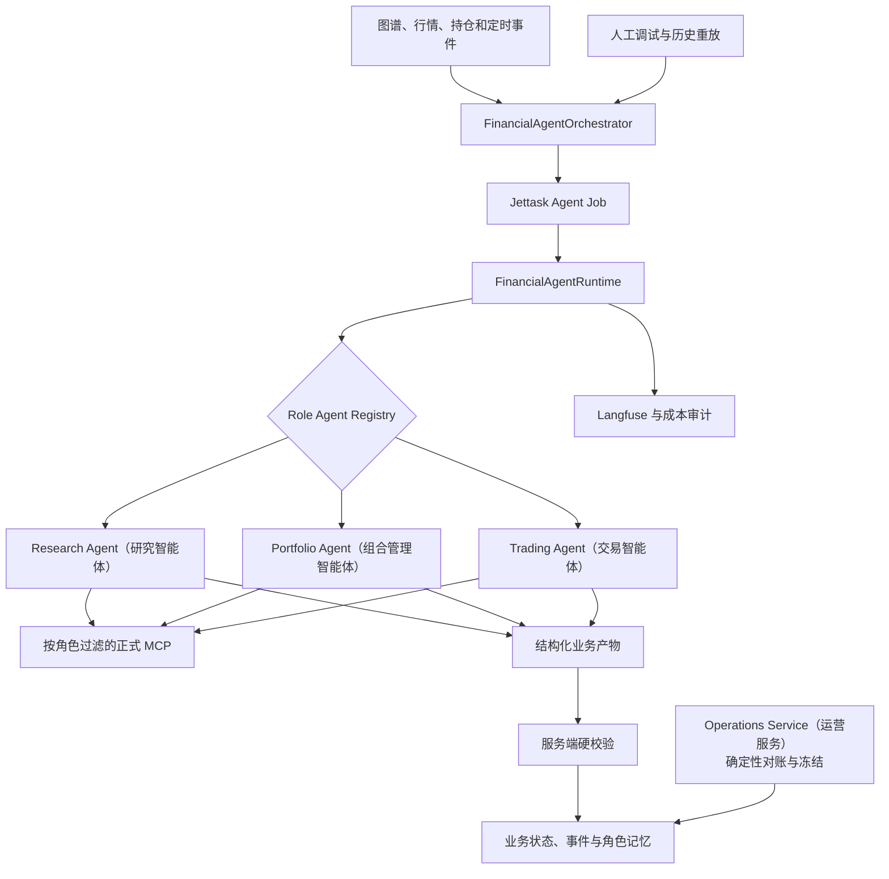

# OpenAI Agents SDK 金融 Agent 运行架构设计方案

## 1. 本文定位

本文定义自动化金融 Agent 使用什么 Runtime、Runtime 与 `smart-fund-server` 如何协作，以及现有确定性任务与自主 Agent 的边界。

本文回答：

- 为什么采用成熟 Agent Runtime，而不是自行实现 Agent Loop；
- 为什么选择 OpenAI Agents SDK；
- 哪些能力由 Agents SDK 承担；
- 哪些能力仍由服务端承担；
- 现有 Card、Relation 和 Community 任务是否迁移；
- 自动任务与人工调试如何复用同一套 Agent；
- Agent Session、业务状态和任务状态如何划分。

本文不定义三个职责 Agent 的业务决策过程。相关内容见：

- `3. 交易型多Agent决策架构总纲.md`
- `4. Research Agent研究智能体设计方案.md`
- `5. Portfolio Agent组合管理智能体设计方案.md`
- `6. Trading Agent交易智能体设计方案.md`
- `7. Agent MCP全局工具与数据能力设计方案.md`

## 2. 选型目标

使用 Agent 框架的目的不是为了引入更多架构，而是复用已经成熟的通用能力，减少系统自行维护的内容。

以下能力不应从零开发：

- 模型与工具的多轮调用循环；
- MCP 工具发现、调用和错误处理；
- Agent Run 的生命周期；
- Session 和运行上下文；
- 结构化输出；
- Guardrail；
- 流式事件和工具调用事件；
- Trace、Token 和费用观测；
- 中断、取消和运行预算控制。

系统仍然必须自行维护金融业务能力：

- 什么事件需要启动研究；
- Investment View 如何形成和演化；
- Card、Edge 和市场数据引用是否真实；
- 哪些状态迁移合法；
- 观点如何映射到标的、风险和交易计划；
- 哪些动作允许进入账户和订单系统。

通用 Agent Runtime 与金融业务状态不能混为一层。

## 3. 技术选型结论

Investment View、单一 Current Research Report 和后续开放式金融研究正式采用 OpenAI
Agents SDK。

选择原因：

- 能够作为 Python Runtime 直接嵌入现有服务和 Worker；
- 提供完整的 Agent Runner 和工具循环；
- 支持远程 Streamable HTTP MCP；
- 支持结构化输出、Guardrail、Session 和生命周期 Hook；
- 支持自定义模型 Provider；
- 能够接入现有 AIClient2API 和多厂商模型体系；
- 同一职责的自动运行和人工调试可以使用同一个 Agent 定义；
- 不要求引入另一套工作流服务器。

本方案不采用 Codex SDK 作为金融 Agent Runtime。Codex 仍可用于软件开发和人工代码调试，但不承担生产金融观点逻辑。

本方案也不引入 LangGraph、CrewAI 或另一套持久工作流框架。现有 Jettask、Redis 和 PostgreSQL 已经负责外层任务可靠性，重复引入同类基础设施会增加状态协调成本。

## 4. 总体架构



架构只有一套 Runtime 实现，但允许多个长期职责 Agent：

- 自动事件、定时检查和人工请求先进入确定性的 `FinancialAgentOrchestrator`；
- Orchestrator 判断是否需要运行、运行哪个角色和使用什么预算，再投递 Jettask；
- Jettask 根据 `agent_role` 和 `task_type` 调用同一 Runtime 中对应的 Agent 定义；
- 每个职责 Agent 拥有独立指令、工具白名单、输入契约、输出 Schema、预算和记忆检索范围；
- 自动任务和人工重放必须调用同一个角色定义，不能为调试另写模型循环；
- 跨职责协作通过经过校验的业务对象和事件完成，不依赖三个 Agent（智能体）共享一段长对话。

`FinancialAgentRuntime` 表示统一的 SDK Runner、模型 Provider、MCP 连接、Hook、审计和
运行策略，不表示系统只能存在一个 `Agent`（智能体）实例，也不表示三个职责必须使用三种模型。
部署初期三个 Agent（智能体）可以共同使用 GLM-5.2，之后再依据各角色评测独立选择模型和预算。

## 5. OpenAI Agents SDK 负责什么

### 5.1 Agent Loop

Agents SDK 负责：

- 调用模型；
- 接收工具调用；
- 执行 MCP 或函数工具；
- 将工具结果加入运行上下文；
- 继续下一轮模型调用；
- 在形成符合约束的最终输出后结束运行；
- 在超出轮次或资源预算时终止。

服务端不再自行实现另一套通用 Tool Calling 循环。

### 5.2 工具管理

Agents SDK 负责：

- 连接正式 MCP 服务；
- 发现和缓存工具定义；
- 根据任务暴露工具子集；
- 处理工具调用失败；
- 记录工具输入、输出和耗时；
- 在需要时执行工具级审批策略。

Agent 不直接访问业务数据库和 Milvus，所有业务读取必须经过正式工具边界。

### 5.3 结构化输出

Agent 最终输出必须符合对应业务对象的统一约束。结构化输出负责保证：

- 必需内容存在；
- 字段类型和枚举合法；
- Agent 决策能够由服务端继续处理；
- 自然语言正文与控制状态可以同时交付。

结构化输出只能保证响应形状，不能证明事实和关系正确。

### 5.4 Guardrail 与 Hook

SDK Guardrail 和生命周期 Hook 用于：

- 限制明显不合法的输入和输出；
- 记录模型轮次和工具调用；
- 收集运行成本和时延；
- 关联 Jettask、Agent Run 和 Langfuse Trace；
- 处理可预期的运行错误。

金融证据校验和状态迁移仍由服务端硬校验负责。

## 6. smart-fund-server 负责什么

### 6.1 业务调度、任务可靠性与 Runtime 的边界

调度和运行必须拆成三个不同职责，不存在一个负责“指挥其他 Agent”的总管模型。

#### FinancialAgentOrchestrator：决定何时运行谁

`FinancialAgentOrchestrator` 是确定性的应用服务，不是 OpenAI Agents SDK `Agent`，也不
调用模型做自由调度。它负责：

- 读取交易日历、市场会话和每个角色的 `Schedule Policy`；
- 接收市场、观点、组合、风险、订单、券商和人工运行事件；
- 判断触发条件、前置业务状态和目标 `agent_role`、`task_type`；
- 执行阈值判断、事件聚合、去重、冷却、优先级和预算准入；
- 确定 `cutoff_at`、运行模式、输入对象引用和本次授权；
- 生成幂等 `FinancialAgentRunRequest` 并投递 Jettask；
- 根据校验后的业务结果发布下游事件，但不自行形成投资判断。

例如，它可以在盘前生成 Research Agent（研究智能体）报告任务；活动 Execution Plan（执行计划）存在时每分钟检查
是否需要创建 Trading Agent（交易智能体）的执行管理任务；没有活动计划时不创建执行任务。这里的判断来自配置、事件和
确定性规则，不来自 Runtime 自己“想要运行”。

#### Jettask：可靠地排队和执行任务

Jettask 负责：

- 任务持久化和队列投递；
- 锁、并发和资源配额；
- 幂等、超时、重试、取消和故障恢复；
- 任务状态和运行结果关联。

Jettask 不理解研究、组合或交易语义，也不决定某个市场变化是否值得启动 Agent；这些由
Orchestrator 的 Role Schedule Policy 判断。

#### FinancialAgentRuntime：运行已经指定的 Agent

`FinancialAgentRuntime`（金融智能体运行时）接收已经明确指定角色的
`FinancialAgentRunRequest`，负责：

- 校验请求中的角色、任务类型、运行模式、预算和授权；
- 从 Role Agent Registry 选择对应 Agent 定义；
- 调用该角色的 Context Builder 组装 Task Pack 和有界 Memory Pack；
- 连接经过角色过滤的 MCP 工具并启动 OpenAI Agents SDK Runner；
- 管理单次 Run 的模型工具循环、轮次、Token、超时、取消、Hook 和 Trace；
- 返回对应 Schema 的结构化结果、工具证据账本和运行元数据。

Runtime 不负责决定下次何时运行，不负责把一个角色的结果自动交给另一个角色，也不直接
修改正式业务状态。结果仍需经过服务端硬校验、幂等写入和事件发布。

完整链路为：

```text
Clock / Business Event / Manual Request
→ FinancialAgentOrchestrator
→ FinancialAgentRunRequest
→ Jettask
→ FinancialAgentRuntime
→ 指定 Role Agent
→ 结构化结果与 Run Evidence Ledger
→ 服务端硬校验和业务写入
→ 新业务事件
→ FinancialAgentOrchestrator 再次判断是否唤醒其他角色
```

`FinancialAgentRunRequest` 至少包含：

- `agent_role`、`task_type`、`run_mode`；
- `trigger_event_id`、`cutoff_at`、`idempotency_key`；
- 上游正式业务对象引用，禁止直接塞入其他 Agent 的完整 Session；
- `schedule_policy_version` 和 Context Builder 版本；
- 最大轮次、Token、时长和费用预算；
- 本次允许运行的工具和写权限域。

除上述分工外，服务端整体继续负责：

- 定时扫描和事件触发；
- Orchestrator 与 Role Schedule Policy；
- Jettask 队列和任务可靠性；
- Agent Run 的准入、启动和取消；
- 任务结果状态。

Agents SDK 不替代 Jettask。

### 6.2 业务状态

服务端负责保存：

- Investment View 当前状态；
- 观点演化历史；
- 触发事件和研究结果；
- 单一 Current Research Report 当前版本及其审计修订；
- Opportunity Watchlist；
- Portfolio Intent、Risk Assessment、Risk Decision；
- Execution Plan、Order Intent、券商订单和成交；
- Reconciliation Result、Exception Case；
- 各职责 Agent 经评测后确认的经验、教训和校准记录。

业务状态不能只存在 Agent Session 或模型上下文中。

### 6.3 硬校验

Agent 结果写入前必须由服务端验证：

- 引用的 Card、Edge 和 Community 是否存在；
- 引用的市场数据是否来自正式工具；
- `observed` 与 `inferred` 是否越界；
- 观点状态迁移是否合法；
- 是否重复创建相同观点；
- 是否尝试执行未授权业务动作。

Agent 可以自主研究，但不能绕过业务不变量。

## 7. 模型接入边界

OpenAI Agents SDK 不直接绑定单一模型厂商。

模型调用继续经过现有统一模型接入层：

```text
Agents SDK
→ Model Provider
→ AIClient2API / LLM Proxy
→ 实际模型厂商
```

统一模型接入层继续负责：

- canonical model 与厂商路由；
- API Key 和 Base URL；
- 模型能力差异；
- 超时和限流；
- Token、费用和缓存信息；
- 请求与响应元数据；
- 厂商故障和后续切换策略。

Agents SDK 不能绕过该层直接连接厂商，否则会形成第二套模型治理和费用记录。

不同模型是否完整支持工具调用、结构化输出和多轮上下文，必须通过运行评测确认，不能仅依赖 OpenAI-compatible 接口声明。

## 8. MCP 工具边界

不同职责 Agent 使用不同的最小工具集合。研究职责首先使用四类工具：

- Graph MCP：检索 Card、Edge、Community 和关系网络；
- Market MCP：查询跟踪名单、最新行情和历史市场数据；
- External Research MCP：搜索、读取和补充公开信息；
- Investment View MCP：查询当前观点和演化历史。

工具能力按最小权限开放：

- 研究任务默认只开放读取工具；
- Agent 不能直接修改 Card、Edge 和 Community；
- Agent 不能直接操作账户和订单；
- 业务写入由服务端在硬校验后完成；
- 大体积工具结果继续支持渐进披露，避免全部进入模型上下文。

Portfolio Agent（组合管理智能体）和 Trading Agent（交易智能体）只在相应能力落地后获得各自工具。Research Agent（研究智能体）
不能读取不必要的账户细节，Portfolio Agent（组合管理智能体）不能提交订单，Trading Agent（交易智能体）不能放宽确定性限制或
修改投资理由。Operations Service（运营服务）不是模型角色，其对账、恢复和冲正能力不进入模型工具集合。

正式业务写入统一由服务端接收结构化 Proposal（提案）后执行，不能使用一个全局 `allow_writes`（允许写入）同时开放全部写能力。

新增工具前必须确认它提供的是业务能力，而不是把数据库表和内部实现直接暴露给 Agent。

## 9. 单 Runtime、三个长期职责 Agent

系统包含三个长期职责 Agent（智能体）：

```text
Research Agent（研究智能体）
→ 模拟研究员，形成和修订 Investment View（投资观点）

Portfolio Agent（组合管理智能体）
→ 模拟投资组合经理，在股票、ETF（交易型开放式指数基金）、场外基金、期货、黄金、美股和现金之间决定持有什么、持有多少

Trading Agent（交易智能体）
→ 先复核组合调整风险，再在获准范围内决定如何成交
```

Operations Service（运营服务）按照确定性规则完成账户、订单、成交、现金和持仓核对。

三个 Agent（智能体）共享 `FinancialAgentRuntime`（金融智能体运行时）的 SDK Runner（软件开发工具包执行器）、模型接入、
MCP（模型上下文协议）连接、Hook（运行钩子）和 Trace（链路追踪），但分别拥有自己的指令、上下文、工具投影、
Session（会话）、结构化输出、长期经验和评测集。

角色间通过正式业务对象交接：

- 只有 Research Agent（研究智能体）可以提出 Investment View Revision（投资观点修订版本）；
- Portfolio Agent（组合管理智能体）只能读取有效观点并提出 Opportunity Candidate（机会候选）、Portfolio Intent（组合意图）、Research Request（研究请求）或 View Challenge（观点质疑）；
- Trading Agent（交易智能体）在风险复核阶段提出 Risk Assessment（风险评估），在获得正式 Risk Decision（风险决策）后，才能在新的执行任务中提出 Execution Plan（执行计划）和 Order Intent（订单意图）；
- 确定性服务生成 Risk Decision（风险决策）、券商订单/成交和 Reconciliation Result（对账结果），模型不能覆盖。

Research Request（研究请求）是下游或用户交给 Research Agent（研究智能体）的输入。Research Agent（研究智能体）必须在本次运行中
自行使用市场、图谱和外部研究工具；关键证据不可得时返回证据不足或阻塞，不能再生成一条研究请求冒充已经完成研究。

外层调度采用事件驱动，三个 Agent（智能体）可以独立运行：

- Research（研究）按盘前、盘中重要变化、收盘、重大材料和观点到期运行；
- Portfolio（组合管理）可以因新观点、组合漂移、现金变化或固定复核点运行；
- Trading（交易）可以因新组合意图、风险异常、获准意图、行情/流动性和订单事件运行；
- Operations Service（运营服务）按券商回报和对账周期持续运行，不调用模型。

调度器可以高频检查，但没有实质变化时不必调用模型。Trading（交易）的秒级硬保护由确定性执行组件承担，不能等待模型运行。

跨长期职责不使用 Handoff（移交）串成长会话。三个角色以 Jettask（Jettask 任务队列）、业务事件和持久化对象为主干；
Handoff（移交）或 Agent-as-tool（智能体作为工具）只用于单次运行内部确有必要的有界子任务，不承担跨日业务状态。

## 10. Session 与业务状态

### 10.1 Session 的用途

Agent Session 只用于：

- 一个指定职责的一次任务中的多轮模型与工具交互；
- 中断后继续同一个 Agent Run；
- 人工调试时查看和继续指定运行。

### 10.2 Session 不能承担的职责

Session 不能作为以下内容的唯一存储：

- 当前 Investment View；
- 观点证据和演化历史；
- 持仓理由；
- Trade Thesis；
- 风险和交易状态。

每次正式任务都必须从业务存储重新加载必要状态。Session 丢失后，系统仍然能够幂等重新执行任务。

### 10.3 角色长期记忆

角色经验不能靠不断追加历史对话实现。服务端应从已完成决策、真实结果和复盘中生成
结构化 `Role Memory`，经过确定性过滤和评测后，在下一次运行按角色、对象、市场状态和
时间范围检索为有界 `Memory Pack`：

- Research Agent（研究智能体）：观点校准、漏判信号、证据源质量和证伪模式；
- Portfolio Agent（组合管理智能体）：跨资产仓位结果、相关性偏差、机会成本和拒绝原因；
- Trading Agent（交易智能体）：限额事件、险情未遂、压力情景、滑点、成交率和流动性经验。

券商差异、对账异常、恢复步骤和重复故障属于确定性运营事件和审计数据，不作为第四个 Agent（智能体）的角色经验。

原始 Session、模型自评和单次盈亏不能自动变成永久规则。记忆必须保留来源事件、适用
范围、生成时间、可信等级和失效条件。经验不能直接改变权限、风险限额或系统 Prompt（系统提示词）；这些变更只能通过
Policy Engine（策略引擎）、签名配置和版本化发布流程在预授权边界内自动完成，超出边界时自动拒绝或保持冻结。

## 11. 现有知识构建任务不迁移

以下流程继续使用固定任务编排：

```text
ft_news
→ Evidence / Chunk
→ Card 抽取
→ Relation Probe
→ 语义召回与 Rerank
→ 关系候选初筛
→ 原文关系核验
→ Edge 入库
→ Community 聚类
```

这些任务具有固定步骤、明确输入输出、高吞吐、批处理和严格幂等要求，不属于开放式 Agent 研究。

把它们迁移到 Agents SDK 会增加不确定的工具调用、延迟、Token 和失败恢复成本。包含 LLM 不等于必须使用 Agent Runtime。

正确边界是：

```text
固定知识流水线：生产可靠知识
Agents SDK：使用知识自主形成判断
```

## 12. 自动运行与人工调试

手动调试不能成为第二个业务入口。自动任务和调试任务必须：

- 对同一职责使用同一个 Agent 定义；
- 使用相同 MCP 工具和工具过滤规则；
- 使用相同结构化输出；
- 使用相同 Guardrail 和服务端硬校验；
- 产生相同的运行事件和 Trace。

允许的差异只有：

- 触发来源；
- 是否写入正式业务状态；
- 隔离实验使用的模型或 Prompt；
- 运行预算和调试日志级别。

人工调试主要用于重放真实事件、观察工具调用和比较模型效果，不承担日常生产逻辑。

## 13. 可观测与审计

每次 Agent Run 都必须能够关联：

- 触发事件；
- Jettask 任务；
- Agent Run；
- 模型轮次；
- MCP 工具调用；
- Token 和费用；
- 最终结构化结果；
- 服务端校验结果；
- 最终业务状态变化。

Langfuse 负责模型和 Agent 运行观测，业务数据库负责正式审计。两者不能互相替代。

敏感数据、持仓和账户信息进入 Trace 前必须遵守最小披露原则。

## 14. 验收口径

### 14.1 Runtime 能力

- 能稳定完成多轮 MCP 调用；
- 能使用统一模型接入层；
- 能输出可校验的结构化结果；
- 能限制最大轮次、时间和资源；
- 能取消和识别失败运行；
- 能完整记录模型与工具事件。

### 14.2 统一运行链路

- 同一职责的自动任务和人工重放使用同一个 Agent 定义；
- 五个职责 Agent 复用同一个 `FinancialAgentRuntime` 和通用模型工具循环；
- 不存在服务端直调 LLM 的第二套观点 Agent；
- 调试模式不能绕过正式业务判断；
- Agent Session 不承载长期业务状态。

### 14.3 现有系统不回归

- Card、Relation、Community 任务不迁移；
- 知识构建吞吐、幂等和恢复不受影响；
- Agents SDK 不重复实现 Jettask；
- 现有模型治理、费用记录和 Langfuse 继续生效；
- Agent Run 失败不会污染知识图谱和有效观点。

### 14.4 权限与证据

- Agent 不能直接修改知识图谱；
- Agent 不能直接操作账户和订单；
- 所有业务写入经过服务端硬校验；
- 所有观点变化能够追溯到正式证据和工具调用；
- 未授权工具不会暴露给 Agent。

## 15. 关键设计结论

1. OpenAI Agents SDK 是交易型金融 Agent 的统一且唯一 Runtime。
2. 采用 SDK 是为了复用成熟 Agent Loop，而不是引入第二套业务系统。
3. FinancialAgentOrchestrator 决定何时运行哪个角色，Jettask 负责任务可靠性，
   FinancialAgentRuntime 与 Agents SDK 负责单次指定 Agent Run。
4. 金融业务状态保存在正式业务存储中，不依赖 Session。
5. 模型调用继续经过 AIClient2API 和统一 LLM 接入层。
6. Agent 只通过正式 MCP 工具访问业务能力。
7. Research（研究）、Portfolio（组合管理）和 Trading（交易）是三个独立职责 Agent（智能体），共用一个 Runtime（运行时），
   但拥有独立上下文、权限、调度、记忆和评测；运营对账由确定性服务负责。
8. 同一职责的自动运行和人工调试复用同一个 Agent 定义；跨职责通过结构化业务对象和
   事件协作，不通过共享长对话串联。
9. 现有 Card、Relation 和 Community 固定流水线不迁移。
10. Agent 自主性不能绕过证据、权限和状态迁移硬边界。
