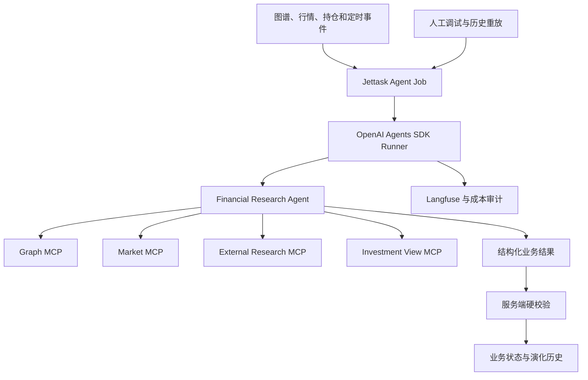

# OpenAI Agents SDK 金融 Agent 运行架构设计方案

## 1. 本文定位

本文定义自动化金融 Agent 使用什么 Runtime、Runtime 与 `smart-fund-server` 如何协作，以及现有确定性任务与自主 Agent 的边界。

本文回答：

- 为什么采用成熟 Agent Runtime，而不是自行实现 Agent Loop；
- 为什么选择 OpenAI Agents SDK；
- 哪些能力由 Agents SDK 承担；
- 哪些能力仍由服务端承担；
- 现有 Card、Relation 和 Community 任务是否迁移；
- 自动任务与人工调试如何复用同一套 Agent；
- Agent Session、业务状态和任务状态如何划分。

本文不定义市场观点的业务形成过程，也不定义标的跟踪规则。相关内容见：

- `3. Agent投资观点形成与持续演化设计方案.md`
- `4. Agent驱动标的持续跟踪设计方案.md`

## 2. 选型目标

使用 Agent 框架的目的不是为了引入更多架构，而是复用已经成熟的通用能力，减少系统自行维护的内容。

以下能力不应从零开发：

- 模型与工具的多轮调用循环；
- MCP 工具发现、调用和错误处理；
- Agent Run 的生命周期；
- Session 和运行上下文；
- 结构化输出；
- Guardrail；
- 流式事件和工具调用事件；
- Trace、Token 和费用观测；
- 中断、取消和运行预算控制。

系统仍然必须自行维护金融业务能力：

- 什么事件需要启动研究；
- Investment View 如何形成和演化；
- Card、Edge 和市场数据引用是否真实；
- 哪些状态迁移合法；
- 观点如何映射到标的、风险和交易计划；
- 哪些动作允许进入账户和订单系统。

通用 Agent Runtime 与金融业务状态不能混为一层。

## 3. 技术选型结论

Investment View、Market Briefing 和后续开放式金融研究正式采用 OpenAI Agents SDK。

选择原因：

- 能够作为 Python Runtime 直接嵌入现有服务和 Worker；
- 提供完整的 Agent Runner 和工具循环；
- 支持远程 Streamable HTTP MCP；
- 支持结构化输出、Guardrail、Session 和生命周期 Hook；
- 支持自定义模型 Provider；
- 能够接入现有 AIClient2API 和多厂商模型体系；
- 自动运行和人工调试可以使用同一个 Agent 定义；
- 不要求引入另一套工作流服务器。

本方案不采用 Codex SDK 作为金融 Agent Runtime。Codex 仍可用于软件开发和人工代码调试，但不承担生产金融观点逻辑。

本方案也不引入 LangGraph、CrewAI 或另一套持久工作流框架。现有 Jettask、Redis 和 PostgreSQL 已经负责外层任务可靠性，重复引入同类基础设施会增加状态协调成本。

## 4. 总体架构



架构只有一套自主 Agent 逻辑：

- 自动任务由系统事件投递；
- 人工任务由调试或历史重放投递；
- 两者调用同一个 Agent 定义和 Runner；
- 服务端只改变运行模式和是否允许写入，不改变业务判断逻辑。

## 5. OpenAI Agents SDK 负责什么

### 5.1 Agent Loop

Agents SDK 负责：

- 调用模型；
- 接收工具调用；
- 执行 MCP 或函数工具；
- 将工具结果加入运行上下文；
- 继续下一轮模型调用；
- 在形成符合约束的最终输出后结束运行；
- 在超出轮次或资源预算时终止。

服务端不再自行实现另一套通用 Tool Calling 循环。

### 5.2 工具管理

Agents SDK 负责：

- 连接正式 MCP 服务；
- 发现和缓存工具定义；
- 根据任务暴露工具子集；
- 处理工具调用失败；
- 记录工具输入、输出和耗时；
- 在需要时执行工具级审批策略。

Agent 不直接访问业务数据库和 Milvus，所有业务读取必须经过正式工具边界。

### 5.3 结构化输出

Agent 最终输出必须符合对应业务对象的统一约束。结构化输出负责保证：

- 必需内容存在；
- 字段类型和枚举合法；
- Agent 决策能够由服务端继续处理；
- 自然语言正文与控制状态可以同时交付。

结构化输出只能保证响应形状，不能证明事实和关系正确。

### 5.4 Guardrail 与 Hook

SDK Guardrail 和生命周期 Hook 用于：

- 限制明显不合法的输入和输出；
- 记录模型轮次和工具调用；
- 收集运行成本和时延；
- 关联 Jettask、Agent Run 和 Langfuse Trace；
- 处理可预期的运行错误。

金融证据校验和状态迁移仍由服务端硬校验负责。

## 6. smart-fund-server 负责什么

### 6.1 外层任务可靠性

服务端继续负责：

- 定时扫描和事件触发；
- Jettask 队列；
- 并发和资源配额；
- 幂等和重复事件合并；
- 超时、重试和故障恢复；
- Agent Run 的启动和取消；
- 任务结果状态。

Agents SDK 不替代 Jettask。

### 6.2 业务状态

服务端负责保存：

- Investment View 当前状态；
- 观点演化历史；
- 触发事件和研究结果；
- Market Briefing；
- Opportunity Watchlist；
- 后续 Trade Thesis 和 Trade Plan 的关联。

业务状态不能只存在 Agent Session 或模型上下文中。

### 6.3 硬校验

Agent 结果写入前必须由服务端验证：

- 引用的 Card、Edge 和 Community 是否存在；
- 引用的市场数据是否来自正式工具；
- `observed` 与 `inferred` 是否越界；
- 观点状态迁移是否合法；
- 是否重复创建相同观点；
- 是否尝试执行未授权业务动作。

Agent 可以自主研究，但不能绕过业务不变量。

## 7. 模型接入边界

OpenAI Agents SDK 不直接绑定单一模型厂商。

模型调用继续经过现有统一模型接入层：

```text
Agents SDK
→ Model Provider
→ AIClient2API / LLM Proxy
→ 实际模型厂商
```

统一模型接入层继续负责：

- canonical model 与厂商路由；
- API Key 和 Base URL；
- 模型能力差异；
- 超时和限流；
- Token、费用和缓存信息；
- 请求与响应元数据；
- 厂商故障和后续切换策略。

Agents SDK 不能绕过该层直接连接厂商，否则会形成第二套模型治理和费用记录。

不同模型是否完整支持工具调用、结构化输出和多轮上下文，必须通过运行评测确认，不能仅依赖 OpenAI-compatible 接口声明。

## 8. MCP 工具边界

第一阶段金融研究 Agent 使用四类工具：

- Graph MCP：检索 Card、Edge、Community 和关系网络；
- Market MCP：查询跟踪名单、最新行情和历史市场数据；
- External Research MCP：搜索、读取和补充公开信息；
- Investment View MCP：查询当前观点和演化历史。

工具能力按最小权限开放：

- 研究任务默认只开放读取工具；
- Agent 不能直接修改 Card、Edge 和 Community；
- Agent 不能直接操作账户和订单；
- 业务写入由服务端在硬校验后完成；
- 大体积工具结果继续支持渐进披露，避免全部进入模型上下文。

新增工具前必须确认它提供的是业务能力，而不是把数据库表和内部实现直接暴露给 Agent。

## 9. 单 Agent 起步

第一阶段只建立一个 Financial Research Agent。

同一个 Agent 可以根据任务目标执行：

- Investment View 创建或更新；
- Market Briefing；
- 持仓逻辑检查；
- Opportunity Watchlist；
- 人工研究和历史重放。

第一阶段不默认拆成多个角色 Agent，也不使用 Handoff 模拟研究团队。只有真实评测证明单 Agent 无法稳定完成某类独立职责时，才增加专业 Agent。

这样可以避免：

- 重复上下文；
- Handoff 信息损失；
- 多 Agent 相互复述；
- Token 和运行时间膨胀；
- 难以判断错误来自哪个 Agent。

## 10. Session 与业务状态

### 10.1 Session 的用途

Agent Session 只用于：

- 一次研究中的多轮模型与工具交互；
- 中断后继续同一个 Agent Run；
- 人工调试时查看和继续指定运行。

### 10.2 Session 不能承担的职责

Session 不能作为以下内容的唯一存储：

- 当前 Investment View；
- 观点证据和演化历史；
- 持仓理由；
- Trade Thesis；
- 风险和交易状态。

每次正式任务都必须从业务存储重新加载必要状态。Session 丢失后，系统仍然能够幂等重新执行任务。

## 11. 现有知识构建任务不迁移

以下流程继续使用固定任务编排：

```text
ft_news
→ Evidence / Chunk
→ Card 抽取
→ Relation Probe
→ 语义召回与 Rerank
→ 关系候选初筛
→ 原文关系核验
→ Edge 入库
→ Community 聚类
```

这些任务具有固定步骤、明确输入输出、高吞吐、批处理和严格幂等要求，不属于开放式 Agent 研究。

把它们迁移到 Agents SDK 会增加不确定的工具调用、延迟、Token 和失败恢复成本。包含 LLM 不等于必须使用 Agent Runtime。

正确边界是：

```text
固定知识流水线：生产可靠知识
Agents SDK：使用知识自主形成判断
```

## 12. 自动运行与人工调试

手动调试不能成为第二个业务入口。自动任务和调试任务必须：

- 使用同一个 Agent 定义；
- 使用相同 MCP 工具和工具过滤规则；
- 使用相同结构化输出；
- 使用相同 Guardrail 和服务端硬校验；
- 产生相同的运行事件和 Trace。

允许的差异只有：

- 触发来源；
- 是否写入正式业务状态；
- 隔离实验使用的模型或 Prompt；
- 运行预算和调试日志级别。

人工调试主要用于重放真实事件、观察工具调用和比较模型效果，不承担日常生产逻辑。

## 13. 可观测与审计

每次 Agent Run 都必须能够关联：

- 触发事件；
- Jettask 任务；
- Agent Run；
- 模型轮次；
- MCP 工具调用；
- Token 和费用；
- 最终结构化结果；
- 服务端校验结果；
- 最终业务状态变化。

Langfuse 负责模型和 Agent 运行观测，业务数据库负责正式审计。两者不能互相替代。

敏感数据、持仓和账户信息进入 Trace 前必须遵守最小披露原则。

## 14. 验收口径

### 14.1 Runtime 能力

- 能稳定完成多轮 MCP 调用；
- 能使用统一模型接入层；
- 能输出可校验的结构化结果；
- 能限制最大轮次、时间和资源；
- 能取消和识别失败运行；
- 能完整记录模型与工具事件。

### 14.2 单一运行链路

- 自动任务和人工重放使用同一个 Agent 定义；
- 不存在服务端直调 LLM 的第二套观点 Agent；
- 调试模式不能绕过正式业务判断；
- Agent Session 不承载长期业务状态。

### 14.3 现有系统不回归

- Card、Relation、Community 任务不迁移；
- 知识构建吞吐、幂等和恢复不受影响；
- Agents SDK 不重复实现 Jettask；
- 现有模型治理、费用记录和 Langfuse 继续生效；
- Agent Run 失败不会污染知识图谱和有效观点。

### 14.4 权限与证据

- Agent 不能直接修改知识图谱；
- Agent 不能直接操作账户和订单；
- 所有业务写入经过服务端硬校验；
- 所有观点变化能够追溯到正式证据和工具调用；
- 未授权工具不会暴露给 Agent。

## 15. 关键设计结论

1. OpenAI Agents SDK 是开放式金融研究的唯一 Agent Runtime。
2. 采用 SDK 是为了复用成熟 Agent Loop，而不是引入第二套业务系统。
3. Jettask 负责外层任务可靠性，Agents SDK 负责单次 Agent Run。
4. 金融业务状态保存在正式业务存储中，不依赖 Session。
5. 模型调用继续经过 AIClient2API 和统一 LLM 接入层。
6. Agent 只通过正式 MCP 工具访问业务能力。
7. 第一阶段采用单 Financial Research Agent，不默认引入多 Agent。
8. 自动运行和人工调试复用同一个 Agent 定义。
9. 现有 Card、Relation 和 Community 固定流水线不迁移。
10. Agent 自主性不能绕过证据、权限和状态迁移硬边界。
