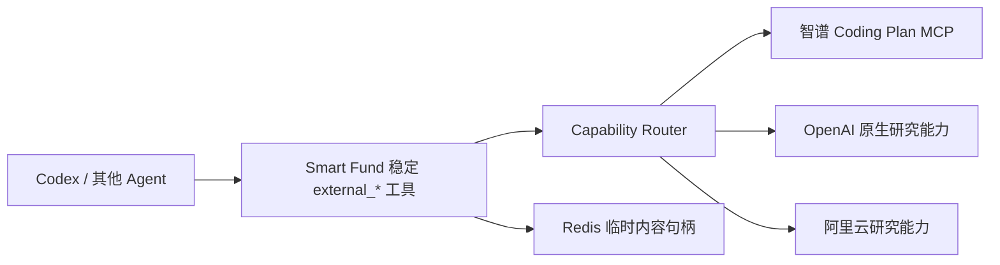
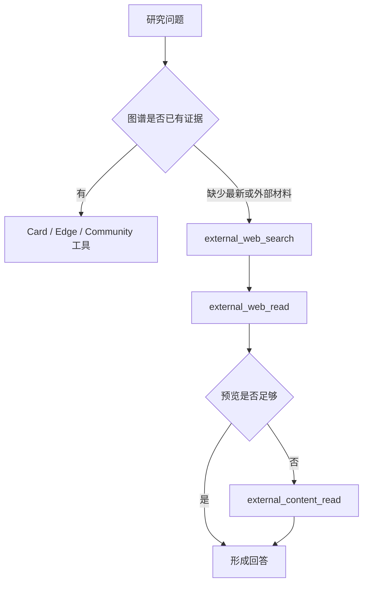

# 多厂商外部研究工具网关设计方案

## 1. 本文定位

本文定义 Smart Fund 如何向 Agent 提供稳定的公开网络与代码仓库研究能力，同时把智谱、OpenAI、阿里云等实际能力供应商隔离在服务端。

## 2. 背景问题

如果 Codex 直接注册某个厂商的 MCP，Agent Skill、工具名、鉴权配置和返回格式都会与该厂商绑定。更换模型或搜索供应商时，需要同步修改每个 Agent 项目，也无法统一控制返回规模、审计调用和保护密钥。

## 3. 目标系统形态

Agent 只认识 Smart Fund 的稳定工具。服务端按 `web_search`、`web_read`、`repository` 等能力选择供应商，供应商名称和私有协议不进入 Agent 工作流。

金融问题始终以关系图为主干。金融时效查询采用混合检索，而不是在 Web
与图谱之间二选一：关系图负责已入库事件、核验关系和传导背景，Web
负责补充当前行情和最新公开事实。

金融优先不是全局工具垄断。Agent 应先识别任务需要的能力：公开网页信息走
Search/Reader，公共代码仓库走 Repository，图片理解走 Vision，本地代码走
Codex 原生工具；复合任务可以组合多类能力。

## 4. 核心设计判断

### 4.1 工具契约属于 Smart Fund

统一提供网络搜索、网页读取、仓库搜索、目录查看、文件读取和大正文分页读取。供应商 Adapter 负责把私有工具名与返回结构转换为统一对象。

### 4.2 图谱证据和外部资料严格区分

关系图 Card 与 Edge 是已进入知识库并经过核验的证据。外部搜索结果只是公开资料，不会因为被 Agent 搜到就自动成为正式 Card 或 Edge。

### 4.3 大正文不直接进入 Agent 上下文

网页和仓库内容先返回有界预览，完整正文以短期内容句柄保存在 Redis。Agent 只有在需要时才读取指定字符范围，避免一次工具调用占满上下文。

### 4.4 供应商切换由服务端完成

今天使用智谱、以后切换 OpenAI 或阿里云时，只新增 Provider 并调整 capability route。Codex 的工具名、Skill 和调用流程保持不变。

### 4.5 Vision 不代理 Agent 本地路径

中央 Smart Fund Server 无法读取 Codex 所在机器的本地图片路径。视觉能力必须先形成服务端可访问的 URL 或上传对象句柄，再由 Provider 处理；在上传协议完成前不暴露一个无法可靠工作的视觉工具。

## 5. Agent 使用体验

## 6. 非目标

- 不把外部搜索结果自动写入知识图谱；
- 不让 Agent 直接持有厂商密钥；
- 不把供应商原始 MCP 工具名暴露给 Agent；
- 不一次返回完整长网页；
- 不伪装支持中央服务无法访问的本地图片路径。

## 7. 验收口径

1. Agent 只注册 Smart Fund MCP 即可同时看到图谱和外部研究工具。
2. 更换能力路由不需要修改 Agent Skill 的工具名。
3. 外部大正文可通过 Redis 句柄分页读取。
4. 搜索结果、网页正文和图谱证据在语义上可明确区分。
5. 调用进入 Langfuse，并记录统一 operation 与实际 provider。
6. 供应商密钥只存在于 Smart Fund Server 部署环境。

## 8. 和实施文档的关系

具体 Provider、Capability Router、Redis 句柄、MCP Tool 和验证方式见《多厂商外部研究工具网关实施方案》。
