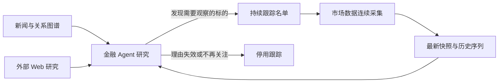

# Agent 驱动标的持续跟踪设计方案

## 1. 本文定位

本文定义金融 Agent 在完成市场研究后，如何把值得持续观察的股票、基金、ETF 或指数加入系统，并在后续会话中读取持续累积的市场数据。

## 2. 背景问题

知识图谱可以帮助 Agent 发现市场事件、跨文档关系和潜在关注方向，但一次检索只能说明“现在为什么值得关注”。自动化金融系统还需要回答：

- 这个标的之后发生了什么；
- 行情、资金流、净值或持仓是否验证了原判断；
- 什么时候需要停止继续消耗采集资源；
- 下一次 Agent 运行时如何直接复用此前的观察结果。

因此，图谱研究后必须有一个可持续、可解释、可停用的标的跟踪层。

## 3. 系统定位

跟踪层不替代图谱和 Web：

- 图谱解释事件之间的关系；
- Web 补充最新公开材料；
- 跟踪层持续积累特定标的的量化和结构化市场数据。

## 4. 目标形态

金融 Agent 应能完成以下闭环：

1. 研究市场并识别具体标的；
2. 带着明确理由加入跟踪名单；
3. 系统立即完成首轮采集；
4. 系统按照每个标的自己的间隔持续更新；
5. Agent 随时查看最新状态和历史变化；
6. 研究理由失效后停用标的，但保留历史数据；
7. 后续再次关注时幂等重新启用并立即补采。

## 5. 核心设计判断

### 5.1 跟踪对象是具体金融标的

跟踪层只接受可规范化的股票、基金、ETF/LOF 和境内指数。主题、行业和新闻事件仍由知识图谱管理，不能伪装成市场代码写入跟踪名单。

### 5.2 跟踪理由是正式状态

Agent 新增标的必须说明原因。原因不参与行情计算，但用于：

- 解释为什么系统长期采集该标的；
- 后续 Agent 复核最初假设；
- 人工审计和资源治理；
- 判断是否应停用。

### 5.3 立即采集与定时采集并存

新增后只等待定时任务会产生不可接受的空窗。系统采用：

- 新增或重新启用后立即采集；
- 常态下定时扫描；
- 每个标的独立维护频率和断点。

### 5.4 停用不删除历史

停用只停止未来采集。历史数据属于已有研究资产，继续可供 Agent 回看。硬删除只作为人工管理操作，不作为 Agent 的默认行为。

### 5.5 失败必须可见

无效代码、上游无数据和连续采集失败不能静默处理。跟踪列表必须向 Agent 暴露最后运行时间、最后成功时间和错误信息。

## 6. Agent 使用策略

Agent 应在以下情况下新增标的：

- 图谱关系显示某事件可能持续影响具体公司或基金；
- 用户明确要求长期观察；
- 当前持仓需要持续监控；
- 需要用后续市场数据验证一个明确假设。

Agent 不应因为一次普通搜索结果就无理由扩充名单，也不应把所有检索命中的标的全部加入。

读取策略：

- 先用列表工具确认是否已跟踪和数据新鲜度；
- 用最新快照判断当前状态；
- 只有在需要趋势、回撤或事件前后对比时再读取指定历史维度；
- 市场数据与图谱证据结合使用，不把价格共振自动解释为因果关系。

## 7. 系统收益

- Agent 的研究从一次性问答变为可持续观察；
- 新发现的标的能立即获得基础市场数据；
- 每个标的的资源消耗有来源和原因可审计；
- 定时采集不会因为共享断点遗漏新加入标的；
- 相同标的重复加入不会产生重复状态和任务；
- 股票、基金、ETF 与指数使用统一工具入口。

## 8. 验收口径

- 新增真实标的后立即产生独立采集任务；
- 首轮任务成功后可读取最新快照；
- 每个标的拥有独立断点和采集间隔；
- 重复新增返回幂等状态，不重复触发；
- 停用后定时扫描不再采集；
- 重新启用后立即补采；
- 单个标的失败不阻断同批其他标的；
- Agent 可通过 MCP 完成新增、列表、更新、快照和历史读取。

## 9. 和实施文档的关系

具体状态字段、任务流程、采集维度、接口清单和测试用例见：

- `docs/3. 实施方案/2. 数据聚合/3. 资金流聚合.md`
