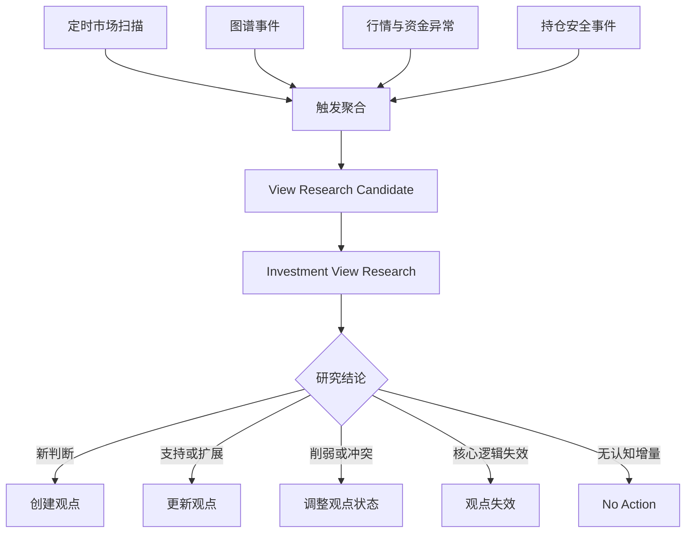
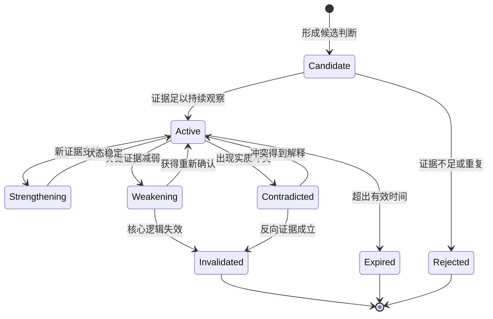
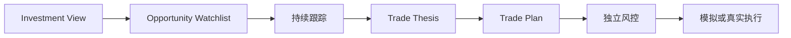
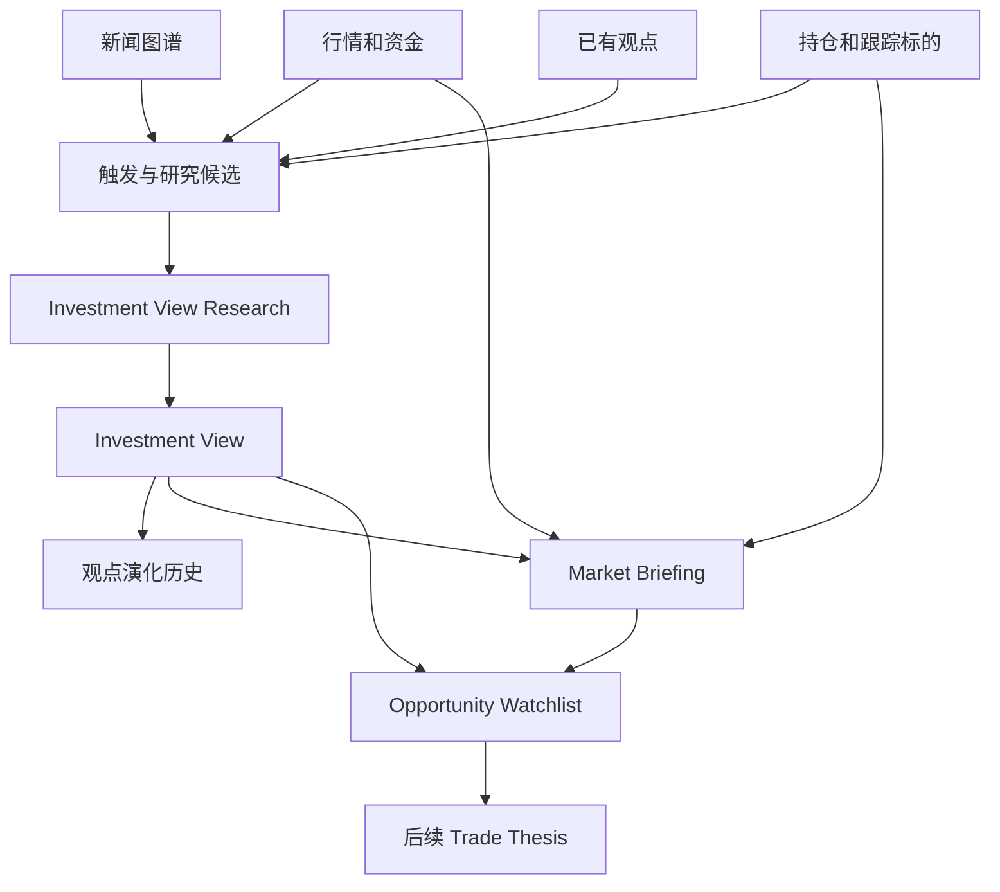

# Agent 市场观点形成与持续演化设计方案

## 1. 本文定位

本文定义自动化金融系统如何像交易员一样持续观察市场、发现值得研究的问题、形成有证据边界的市场观点，并在新信息到达后修正观点。

本文回答的是金融业务问题：

- 系统每天观察什么；
- 什么变化值得触发研究；
- 如何区分核心驱动、有效线索和噪声；
- 如何形成、保存和更新 Investment View；
- 如何检查原有持仓逻辑；
- 如何从市场观点中选出当天最值得观察的三到五个机会。

本文不定义 Agent Runtime、模型接入、MCP 生命周期和任务运行架构。相关内容见：

- `1. OpenAI Agents SDK金融Agent运行架构设计方案.md`

本文也不涉及最终仓位、真实下单和券商执行。

## 2. 背景问题

当前系统已经具备：

- 新闻事实、Card、关系边和 Graph Community；
- 面向 Agent 的图谱搜索与证据读取；
- 外部公开信息搜索与原文读取；
- 股票、基金、ETF 和指数的持续跟踪；
- 最新行情、历史序列和部分资金数据查询。

这些能力能够回答一次检索问题，但还不能替代交易员的持续工作。系统尚未形成以下闭环：

```text
观察市场
→ 发现异常或新线索
→ 提出需要回答的问题
→ 研究事实、关系和市场响应
→ 形成观点
→ 持续验证
→ 发现观点强化、削弱或失效
→ 选择值得观察的机会
```

如果直接从新闻或 Community 跳到交易信号，会缺少最关键的中间层：系统为什么相信某件事、该判断由什么证据支持、什么变化会推翻它。

## 3. 对应交易员的日常工作

系统要模拟的不是交易员阅读新闻的动作，而是交易员把不同信息放在一起形成判断的过程。

| 交易员需要回答的问题 | 系统中的对应能力 |
| --- | --- |
| 当前市场的核心驱动是什么 | 综合隔夜行情、图谱事实、资金变化和活跃观点形成 Market Briefing |
| 哪些行业正在获得资金 | 使用板块、ETF、成交量、相对强弱和资金数据进行确认 |
| 哪些事件只是噪声 | 判断其是否带来新的事实、关系、市场响应、观点变化或持仓影响 |
| 原有持仓逻辑有没有被破坏 | 将新事实和行情变化与持仓对应的观点、Trade Thesis 和失效条件比较 |
| 今天最值得观察的机会是什么 | 从有效观点映射候选资产，并结合最新市场状态形成 Opportunity Watchlist |

新闻图谱、行情数据、持仓和已有观点分别回答不同问题：

- 图谱解释“发生了什么、事实之间为什么有关”；
- 行情和资金解释“市场是否正在响应”；
- 持仓解释“哪些变化与当前风险直接相关”；
- 已有观点解释“系统过去相信什么，现在是否需要改变”。

任何单一来源都不能独立完成市场观点形成。

## 4. 核心对象

### 4.1 Trigger Signal

Trigger Signal 表示系统观察到一个可能值得研究的变化，例如新增重要事实、关系冲突、异常行情或持仓风险。

它只说明“可能需要研究”，不代表观点成立，也不要求一定产生 Investment View。

### 4.2 View Research Candidate

View Research Candidate 是经过触发聚合后形成的具体研究问题。

它必须围绕问题组织，而不是围绕 Community 目录组织。例如：

```text
新的出口限制是否改变现有半导体供应链判断？
存储价格上涨是否已经向手机厂商产品策略传导？
新的公司公告是否破坏当前业绩改善逻辑？
```

以下内容不能作为合格的研究问题：

```text
总结半导体 Community。
分析今天所有新闻。
寻找可能上涨的股票。
```

### 4.3 Investment View

Investment View 是系统对当前市场、产业链、政策或企业状态形成的、有证据边界的阶段性判断。

它回答：

> 当前证据共同说明了什么，这一判断可能影响谁，还缺少什么确认，什么变化会使它失效。

Investment View 可以不对应具体股票，也不必立即产生交易动作。

### 4.4 Market Briefing

Market Briefing 是对某个观察周期内市场状态的综合判断，重点回答：

- 当前核心驱动；
- 主要资金方向；
- 关键风险和冲突；
- 活跃观点发生的变化；
- 需要继续研究的问题。

Market Briefing 不是所有新闻的摘要，也不替代 Investment View。它使用已经形成的观点解释市场，并为遗漏的新问题生成研究候选。

### 4.5 Opportunity Watchlist

Opportunity Watchlist 是从当前有效观点中筛选出的重点观察机会集合。

它表达“今天最值得继续验证什么”，而不是直接表达“今天必须买什么”。候选对象可以是：

- 行业或产业链方向；
- 股票；
- 基金或 ETF；
- 商品、指数或跨市场组合。

### 4.6 与相邻对象的区别

| 对象 | 回答的问题 |
| --- | --- |
| Card | 单一来源中发生了什么 |
| Edge | 两个事实为什么有关 |
| Community | 哪些事实形成关系网络 |
| View Research Candidate | 当前最需要研究什么问题 |
| Investment View | 当前证据整体说明了什么 |
| Market Briefing | 当前市场的主线、资金和风险是什么 |
| Opportunity Watchlist | 哪些方向值得优先观察和验证 |
| Trade Thesis | 为什么值得交易某个具体标的 |
| Trade Plan | 什么条件下交易、如何退出 |

Community 只负责图谱导航和关系范围，不是观点生成单位。Investment View 可以使用一个 Community 的局部证据，也可以跨多个 Community 形成判断。

## 5. 观点形成所需的信息

### 5.1 隔夜与当前市场状态

系统需要获得与当前交易时段相匹配的市场快照，包括：

- 主要股票指数；
- 期货、商品、汇率和利率；
- 海外市场和跨市场变化；
- 重要板块、ETF 和成交结构；
- 当前交易日的异常波动。

这些数据用于识别市场正在交易什么，不能单独证明波动原因。

### 5.2 新闻事实与关系图谱

Card、Edge 和 Community 提供：

- 已发生事实；
- 跨文档确认和冲突；
- 时间顺序；
- 上下游传导和共同驱动；
- 需要继续补充的关系链。

Agent 必须围绕研究问题按需打开证据，不能把整个 Community 全量输入后强行总结。

### 5.3 资金与市场确认

观点需要尽可能检查：

- 行业和主题的相对强弱；
- 成交量和资金变化；
- ETF、板块或标的是否出现持续响应；
- 价格反应是局部、短暂还是跨市场一致；
- 市场表现是否与新闻叙事冲突。

没有市场响应不等于观点错误，但必须降低对“市场已经开始交易该逻辑”的确信。

### 5.4 当前持仓和跟踪标的

系统需要知道：

- 当前持有哪些资产；
- 为什么持有；
- 对应哪个 Investment View 和 Trade Thesis；
- 需要持续观察哪些指标；
- 哪些条件会使原逻辑失效。

持仓相关变化必须获得高于普通市场线索的处理优先级。

### 5.5 已有观点及其历史

新的研究不能每次从零开始。Agent 需要读取：

- 当前活跃观点；
- 支持和冲突证据；
- 上一次更新时间；
- 当前待验证条件；
- 历史上发生过的强化、削弱和失效；
- 已映射的行业和资产。

新证据应优先更新已有观点，而不是创建多个近义观点。

## 6. 四类正式触发入口

### 6.1 定时市场扫描

定时扫描保证系统不会因为缺少显式事件而停止观察市场。

典型观察周期包括：

- 盘前：隔夜市场、政策、重大新闻和持仓风险；
- 盘中：异常行情、资金变化和观点验证；
- 盘后：市场主线、活跃观点变化和次日观察方向；
- 非交易日：周度主线、观点复盘和风险检查。

定时扫描不要求每次创建新观点，但必须检查当前市场状态是否产生了新的研究问题。

### 6.2 图谱事件触发

可能触发研究的图谱变化包括：

- 新增高重要性 Card；
- 新增关键关系边；
- 同一事实获得新的独立确认；
- 出现实质冲突或约束关系；
- 某条关系连接到活跃观点或持仓；
- Community 的结构发生显著变化。

图谱变化用于提出问题，不能直接把 Community 转换成报告。

### 6.3 行情和资金触发

即使没有新闻，下列变化也可能需要重新研究：

- 标的或板块出现异常涨跌；
- 成交量、资金流或波动率明显变化；
- 观点预期方向与市场表现持续背离；
- 上游价格、库存或汇率达到关键观察状态；
- 多个相关市场出现同步或反向变化。

系统必须允许从市场行为反向寻找解释，不能只从新闻向价格单向推导。

### 6.4 持仓安全触发

持仓安全检查优先处理：

- 核心事实被否定；
- 关键指标达到失效条件；
- 持仓出现无法解释的异常波动；
- 观点适用时间已经结束；
- 新政策、公司事实或产业变化冲击原有逻辑；
- 风险暴露与最初假设发生偏离。

该触发只负责检查逻辑是否仍然成立，不直接执行平仓或调仓。



## 7. 触发聚合与研究优先级

### 7.1 触发不等于观点

任何触发都只能产生研究候选。观点必须在完成证据和市场检查后形成。

孤立新闻可能形成有价值的新线索，多个热门报道也可能只是同一事实的重复。系统不能简单使用新闻数量、Community 大小或节点度数决定观点是否成立。

### 7.2 按研究问题聚合

短时间内指向同一个问题的触发应合并，避免 Agent 对同一变化重复研究。

聚合依据是它们是否共同回答同一个判断，而不是是否属于同一个主题目录。一个候选可以跨 Community，一个 Community 也可以产生多个互不相同的研究候选。

### 7.3 优先级

优先级主要由以下因素共同决定：

- 是否直接涉及持仓；
- 是否可能破坏已有观点；
- 事件的重要性和时效性；
- 是否出现独立确认、冲突或关键关系；
- 是否已经出现价格或资金响应；
- 距离上一次观点更新时间；
- 是否影响多个市场或资产。

优先级决定何时研究和投入多少资源，不决定最终观点方向。

### 7.4 缓冲与立即触发

- 持仓风险、重大政策和核心观点冲突应立即研究；
- 短时间内连续到达的普通证据应先合并，再触发一次研究；
- 低优先级孤立线索可以等待下一次定时扫描；
- 定时扫描负责兜底，避免缓冲和阈值造成永久遗漏。

阈值的作用是控制 Agent 成本和重复工作，不是判断事实真伪。

## 8. View Research Candidate 的内容边界

一个研究候选应向 Agent 提供：

- 需要回答的具体问题；
- 触发原因和发生时间；
- 当前市场和交易时段；
- 可能受影响的已有观点；
- 当前持仓和重点跟踪对象；
- 初始 Card、Edge 或行情线索；
- 已知的支持、冲突和待验证方向。

研究候选不应提前替 Agent 写出结论，也不应把整个图谱、全部行情或完整 Community 作为默认上下文。

## 9. 观点形成流程

### 9.1 理解问题

Agent 首先确定：

- 本次研究要解释什么变化；
- 需要更新已有观点还是寻找新观点；
- 结论适用于市场、行业、产业链、公司还是具体资产；
- 当前时间窗口和信息时效性。

### 9.2 检索已有观点

Agent 优先查找表达相同核心判断、依赖相近关系链或具有相同验证条件的观点。

如果已有观点可以承载新信息，应更新该观点；只有核心判断明显不同，才创建新观点。

### 9.3 获取事实和关系

Agent 围绕问题：

- 搜索相关 Card；
- 打开关键 Edge；
- 按需扩展局部关系图；
- 检查独立确认、冲突和时间顺序；
- 必要时补充外部公开来源。

Community 只帮助定位关系范围，不能替代 Edge 和原始证据。

### 9.4 检查市场响应

Agent 根据观点类型检查相关：

- 行业、ETF 或标的表现；
- 成交和资金变化；
- 上下游价格与库存；
- 跨市场一致性；
- 当前持仓和跟踪对象。

市场数据用于验证观点是否已经产生可观察影响，不能把同步涨跌自动解释为因果关系。

### 9.5 形成判断

Agent 最终只能选择：

```text
create       形成新的 Investment View
support      新证据支持已有观点
weaken       新证据削弱关键环节
contradict   新证据与核心判断冲突
extend       补充新的关系环节或影响对象
invalidate   核心逻辑已经失效
no_action    没有足够认知增量，不改变观点
```

`no_action` 是正常结论。系统不应为了证明 Agent 有工作而强制生成观点。

### 9.6 服务端硬边界

- 事实必须能够回到 Card 或已打开的外部来源；
- 关系判断必须能够回到 Edge；
- `observed` 与 `inferred` 必须明确区分；
- 市场响应与事件因果不能混写；
- 缺少证据时只能保留待验证假设；
- Agent 不能直接修改 Card、Edge 和 Community；
- 观点状态变化必须保留原因和历史。

## 10. Investment View 应表达什么

### 10.1 核心判断

使用自然语言说明多份材料合在一起产生的认知增量，不能只是 Card 摘要拼接。

### 10.2 事实基础与关系链

说明观点依赖的关键事实、时间顺序和已核验关系。

### 10.3 支持、冲突与缺口

同时保留：

- 支持当前判断的证据；
- 削弱或冲突证据；
- 仍未得到确认的关键环节。

### 10.4 市场确认

说明相关市场、行业或资产是否已经出现响应，并区分：

- 已经观察到的市场事实；
- 根据关系链推导的潜在影响；
- 尚未出现确认的候选方向。

### 10.5 影响范围

说明可能受到影响的行业、商品、市场和资产，但不能因为主题相关就无条件建立影响关系。

### 10.6 待验证和失效条件

观点必须说明下一步需要观察什么，以及什么变化会使核心逻辑失效。

### 10.7 时间与置信边界

观点必须具有适用时间范围。置信程度表达当前证据状态，不能直接转换为仓位。

## 11. 观点生命周期与持续演化



每次变化都必须保留：

- 触发变化的新信息；
- 观点发生了什么变化；
- 为什么改变；
- 使用了哪些新增或失效证据；
- 改变前后的状态。

系统维护当前观点，同时保留不可覆盖的演化记录，避免事后改写历史判断。

## 12. 每日市场复盘与机会清单

### 12.1 Market Briefing 的形成

完成当前周期的观点更新后，系统综合：

- 隔夜和当前市场表现；
- 当期新建、强化、削弱和失效的观点；
- 主要资金方向；
- 持仓风险；
- 尚未完成研究的重要候选。

Market Briefing 重点回答：

1. 当前市场核心驱动是什么；
2. 哪些行业和资产正在获得资金；
3. 哪些叙事缺少市场确认；
4. 哪些事件没有产生认知增量；
5. 当前持仓逻辑是否受到影响；
6. 下一观察周期最重要的验证点是什么。

### 12.2 Opportunity Watchlist 的形成

机会清单只能从有证据边界的 Investment View 产生。候选排序需要综合：

- 观点证据是否完整；
- 观点是否新鲜；
- 市场是否开始确认；
- 影响对象是否明确；
- 是否具备可持续观察的数据；
- 主要风险和失效条件是否清楚；
- 是否与现有持仓产生重复或集中风险。

系统最终选择三到五个最值得继续观察的机会。数量是注意力管理目标，不是强制凑数；没有合格机会时可以少于三个或为空。

### 12.3 噪声的处理

以下信息更可能进入 `no_action`，但不能仅靠固定规则直接删除：

- 与已有事实完全重复且没有新增确认价值；
- 只有共同主题，没有可解释关系；
- 单日小幅波动且没有其他市场或事实支持；
- 与当前观点、持仓和研究问题无实质关联；
- 缺少来源、时间或事实边界；
- 只提供情绪表达，没有可验证主张。

噪声判断必须保留原因，便于后续评估系统是否错过了早期信号。

## 13. 从观点到交易的边界



进入 Trade Thesis 前至少需要：

- 观点与具体标的之间存在可解释映射；
- 对应市场数据足够新鲜；
- 入场、失效和退出条件能够被持续观察；
- 观点不是仅由单一弱证据支持；
- 用户或系统策略允许该类资产进入候选范围。

Investment View 和 Opportunity Watchlist 均不负责：

- 计算最终仓位；
- 决定账户风险预算；
- 提交、修改或撤销订单；
- 处理成交和券商对账；
- 把观点置信度直接转换为买卖方向。

## 14. 目标系统形态



系统最终形成两条互相配合的循环：

```text
事件循环：
新事实或市场变化
→ 研究候选
→ 创建或更新观点
→ 保存演化历史

市场循环：
定时观察市场
→ 检查活跃观点和持仓
→ 形成 Market Briefing
→ 选择 Opportunity Watchlist
→ 产生新的研究和持续跟踪任务
```

## 15. 系统收益

- 市场观察不再依赖人工主动提问；
- 新闻、图谱、行情、资金和持仓围绕同一个判断协同工作；
- 新事实优先验证已有观点，不再每次从头研究；
- 系统能够解释为什么某个标的进入长期跟踪；
- 噪声可以不改变正式观点，同时保留错失信号的评估依据；
- 每日机会清单来自有效观点，而不是从热门新闻直接选股；
- 后续 Trade Thesis 可以追溯到观点形成和演化过程；
- 人类能够复盘系统在每个时间点为什么改变判断。

## 16. 验收口径

### 16.1 触发覆盖

- 定时扫描、图谱事件、行情异常和持仓风险都能产生研究候选；
- 高优先级持仓风险能够立即进入研究；
- 普通重复触发能够合并；
- 阈值和缓冲不会造成永久遗漏。

### 16.2 观点质量

- 观点包含跨文档或跨数据源的认知增量；
- 核心判断、关系链、市场确认和不确定性清楚；
- 不把 Community 摘要当作观点；
- 不把同步行情包装成已证明的因果；
- 没有足够价值时能够输出 `no_action`。

### 16.3 持续演化

- 新证据能够召回正确的已有观点；
- 支持材料能够增强而不重复创建观点；
- 冲突材料能够改变状态并保留历史；
- 无关信息不会频繁改写观点；
- 过期或失效观点能够退出活跃集合。

### 16.4 市场复盘

- Market Briefing 能解释核心驱动、资金方向、主要风险和观点变化；
- 持仓逻辑得到单独检查；
- Opportunity Watchlist 能追溯到有效观点和市场数据；
- 机会不足时不会为了数量要求强行凑满；
- 机会清单不直接产生订单。

### 16.5 可审计性

- 每个观点能够追溯到触发原因和证据；
- 每次观点变化都有不可覆盖的历史；
- `no_action` 和噪声判断保留原因；
- 市场观点、条件性推演和交易计划边界明确。

## 17. 关键设计结论

1. 市场观点围绕具体研究问题形成，不围绕 Community 目录生成。
2. 定时扫描和事件触发共同驱动研究，任何单一入口都不足以覆盖交易员工作。
3. 触发只产生研究候选，不直接产生观点。
4. 阈值只控制成本和重复工作，不判断观点真伪。
5. 新闻图谱、市场数据、持仓和已有观点必须共同参与判断。
6. 新信息优先更新已有观点，没有认知增量时允许 `no_action`。
7. Market Briefing 负责解释市场，Investment View 负责维护具体判断。
8. Opportunity Watchlist 从有效观点产生，但不是交易指令。
9. 持仓安全检查优先级高于普通市场线索。
10. 观点形成之后，才进入标的映射、Trade Thesis、风控和执行阶段。
