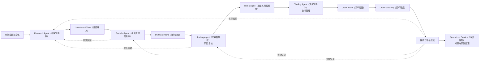

# 交易型多 Agent（智能体）决策架构总纲

> 阅读方式：先理解系统怎么运转，再查正式对象和技术边界。英文只在需要对应代码、协议或固定名称时保留，并附中文说明。

## 1. 先用一分钟理解整个系统

这套系统不是让一个大模型同时研究市场、管理仓位、控制风险和操作订单。

它把交易决策拆给三个可以独立运行的 Agent（智能体）：

```text
Research Agent（研究智能体）
回答：市场发生了什么，我现在相信什么？

Portfolio Agent（组合管理智能体）
回答：这些观点中，当前账户应该持有什么、持有多少？

Trading Agent（交易智能体）
回答：这个组合调整是否安全，应该怎样成交？
```

账户、订单、成交、现金和持仓的核对不交给大模型，而是由 Operations Service（运营服务）等确定性程序完成。

一次完整但不强制每次都走完的链路是：

```text
市场出现变化
→ Research 形成或修订观点
→ Portfolio 判断是否需要调整组合
→ Trading 先复核风险，再管理成交
→ 确定性服务核对账户和订单
→ 实际结果分别反馈给三个 Agent
```

每个 Agent（智能体）都可以独立运行，也可以得出“不改变观点”或“不采取行动”。系统不是一条每次必须从头走到尾的固定流水线。

## 2. 三个 Agent（智能体）

系统的角色和职责如下：

| Agent（智能体） | 职责 | 最核心的问题 |
|---|---|---|
| Research Agent（研究智能体） | 市场研究与观点管理 | 当前最可信的市场解释和投资观点是什么？ |
| Portfolio Agent（组合管理智能体） | 跨资产组合与仓位管理 | 哪些观点值得在当前组合中表达，应该表达多少？ |
| Trading Agent（交易智能体） | 风险复核与执行管理 | 组合调整是否安全，获准以后应该怎样成交？ |

Trading Agent（交易智能体）包含风险复核和执行管理两个独立任务阶段，两者使用不同上下文和权限。

Portfolio Agent（组合管理智能体）统一管理股票、ETF（交易型开放式指数基金）、场外基金、期货、黄金、美股、现金和
后续接入的其他资产。

Operations Service（运营服务）、Risk Engine（确定性风控引擎）、Order Gateway（订单网关）和
Reconciliation Engine（对账引擎）按照确定性规则完成风控、下单、对账、冻结、恢复和异常处理。

## 3. 三个 Agent（智能体）怎样协作

它们不靠共享一条长聊天记录协作，而是传递经过服务端校验的业务对象：



这里有三个重要含义：

1. Research（研究）有新观点，不代表 Portfolio（组合管理）一定要持有；
2. Portfolio（组合管理）希望调整，不代表 Trading（交易）一定批准；
3. Trading（交易）获准执行，也不能绕过订单网关直接调用券商。

## 4. 谁能修改什么

每类正式对象只有一个提议者，避免三个 Agent（智能体）互相改写结论：

| 正式对象 | 谁可以提出 | 其他角色可以做什么 |
|---|---|---|
| Current Research Report（当前研究报告）、Investment View Revision（投资观点修订版本） | Research Agent（研究智能体） | 读取、引用、质疑；不能直接修改 |
| Opportunity Candidate（机会候选）、Portfolio Intent（组合意图） | Portfolio Agent（组合管理智能体） | Trading（交易）可以缩减或拒绝；Research（研究）不能决定仓位 |
| Risk Assessment（风险评估）、Execution Plan（执行计划）、Order Intent（订单意图） | Trading Agent（交易智能体） | Portfolio（组合管理）读取结果；不能绕过确定性门禁 |
| Risk Decision（风险决策） | Risk Engine（确定性风控引擎） | 所有 Agent（智能体）只能接受和引用 |
| 券商订单、成交和对账结果 | 订单、券商和运营基础设施 | Agent（智能体）只读获准摘要，不能改写 |

Agent（智能体）输出的都只是 Proposal（提案）。服务端检查证据、版本、状态、权限、截止时间和重复提交后，才把它变成正式对象。

## 5. 谁决定什么时候运行

`FinancialAgentOrchestrator`（金融智能体编排器）负责“什么时候运行谁”。它是普通程序，不是一个负责指挥其他角色的大模型。

它会：

- 接收定时任务、市场变化、观点变化、组合漂移、风险异常和订单事件；
- 合并重复事件，确定本次运行的角色、任务和决策截止时间；
- 准备本角色需要的上下文和权限；
- 把任务放入 Jettask（Jettask 任务队列）；
- 在运行结束后调用服务端校验，并根据正式结果产生下一个事件。

`FinancialAgentRuntime`（金融智能体运行时）负责“怎样完成这一次已经确定的运行”。它会选择正确的 Agent（智能体）定义、
模型、只读工具、会话、预算和结构化输出格式。

简单地说：

```text
Orchestrator（编排器）决定何时运行谁
Runtime（运行时）负责把这一次运行完成
```

自动任务、人工调试和历史重放都必须复用同一套 Runtime（运行时），不能另写一套模型调用循环。

### 5.1 编排器不把三个智能体变成串行流水线

三个智能体采用“独立触发、事件联动、局部依赖、版本化提交”，并非每次都固定执行：

```text
Research → Portfolio → Trading
```

同一时刻完全可以存在：

```text
Research Run R101（研究运行 R101）：研究黄金板块的新变化
Portfolio Run P201（组合运行 P201）：复核昨天确认的半导体观点
Trading Run T301（交易运行 T301）：处理已有订单的流动性变化
```

只有同一条决策链中存在直接依赖的部分需要等待上游正式产物。例如，Portfolio（组合管理）不能使用尚未提交的新观点，但可以同时复核其他既有观点；Trading（交易）也可以继续管理此前已经批准的组合意图。

Orchestrator（编排器）只是交通调度中心。它不会代替模型判断市场方向、资产表达、目标仓位或成交方式。

### 5.2 角色与运行实例必须分开

Research Agent（研究智能体）、Portfolio Agent（组合管理智能体）和 Trading Agent（交易智能体）是三个长期角色定义。每次具体工作则是隔离的 Role Run（角色运行实例）：

```text
Research Agent（同一个角色）
├── Research Run R101：研究黄金
└── Research Run R102：复核半导体质疑
```

R101 和 R102 不是两个永久存在、拥有不同人格的 Research Agent（研究智能体）。它们复用同一个角色定义，但各自拥有独立的 Trigger（触发器）、Session（会话）、Context Pack（上下文包）、Langfuse Trace（链路记录）、工具调用和 Proposal Draft（提案草稿）。

角色不是永不结束、持续接收其他角色消息的常驻模型会话。采用运行实例才能让任务隔离、并行、重放和审计，避免不同研究对象污染同一个上下文。

### 5.3 智能体之间怎样传递信息

智能体之间不直接聊天，不共享一条长会话，也不读取对方的内部推理过程。它们只交换经过服务端校验、版本化并持久化的业务对象：

| 上游角色 | 正式产物 | 下游用途 |
|---|---|---|
| Research（研究） | Investment View Revision（投资观点修订） | Portfolio（组合管理）判断是否以及怎样在组合中表达 |
| Portfolio（组合管理） | Portfolio Intent（组合意图） | Trading（交易）复核风险并制定执行计划 |
| Trading（交易） | Risk Assessment（风险评估）、Execution Plan（执行计划）、执行反馈 | Portfolio 复核目标，Research 验证市场反应和观点 |
| Operations（运营服务） | 账户、持仓、订单、成交和对账事实 | 三个角色按权限读取真实结果 |

每个下游运行收到的是自己的 Context Pack（上下文包），其中包含本次任务需要的上游对象版本和少量摘要；需要细节时再通过 MCP（模型上下文协议）下钻。完整聊天记录和无关工具结果不在角色间传播。

### 5.4 下游质疑如何回到上游

下游不能直接修改上游拥有的正式对象，只能提交结构化反馈：

- Research Request（研究请求）：当前研究没有回答组合或交易判断需要的问题；
- View Challenge（观点质疑）：新的账户、表达、价格或交易事实可能削弱或推翻某个观点；
- Intent Challenge（组合意图质疑）：Trading 发现组合目标在风险、流动性或执行上存在实质问题；
- Execution Feedback（执行反馈）：实际成交、滑点、容量或市场冲击与上游假设不一致。

反馈至少绑定被质疑对象及版本、具体主张、理由、实际打开的证据引用、请求核查项和紧急程度。Result Committer（结果提交器）校验并保存反馈后，Orchestrator（编排器）发布事件并创建对应角色的新运行。

### 5.5 上游已经在运行时怎样处理新反馈

新反馈不会被强行插入一个已经运行的模型上下文。例如：

```text
R101：Research 正在研究黄金
P201：Portfolio 复核半导体后提出质疑
→ 保存半导体 View Challenge（观点质疑）
→ 创建 R102 专门复核半导体
→ R101 继续完成黄金研究
```

动态插入无关任务会污染注意力，形成新旧上下文混合结论，并破坏 Langfuse（大语言模型可观测平台）审计和历史重放，因此禁止这样做。

如果反馈与正在运行的任务属于同一业务对象：

- 普通反馈：进入该对象待处理队列，当前运行结束后创建复核运行；
- 紧急反证：允许创建并行复核运行，并把当前运行标记为 `pending_challenge（存在待处理质疑）`；
- 重复反馈：合并进已有事件，不创建重复任务；
- 当前运行提交时发现对象版本或质疑状态已变化：不得直接发布为最新正式结果，必须重新复核。

### 5.6 并发与版本冲突怎样控制

系统区分：

- Cross-role Concurrency（跨角色并发）：三个角色可以同时运行；
- Cross-scope Concurrency（跨范围并发）：同一角色研究不同对象可以同时运行；
- Same-object Concurrency（同一对象并发）：可以并行读取和分析，但不能无条件同时提交。

每个运行携带自己基于的对象版本。例如两个运行都基于 `revision=3（修订版本 3）`，其中一个先发布了 `revision=4（修订版本 4）`，另一个旧版本提案就不能覆盖最新结果。服务端采用 Optimistic Concurrency Control（乐观并发控制）拒绝旧版本提交，并把其中新增证据保留为待复核材料。

Orchestrator（编排器）按业务对象生成 Scope Key（范围键），例如：

```text
research:commodity:gold
research:sector:semiconductor
research:view:VIEW-102
portfolio:account:ACCOUNT-1
portfolio:intent:INTENT-9
trading:intent:INTENT-9
```

- 不同 Scope Key（范围键）：允许并行；
- 相同 Scope Key 且事件可以合并：合并处理；
- 相同 Scope Key 的普通运行接近完成：排队等待；
- 同一对象出现紧急反证：允许并行分析，提交时执行版本检查；
- 达到资源并发上限：按业务优先级排队，而不是把三个角色全局串行化。

### 5.7 记忆并发与反馈收敛

运行实例不能直接覆盖长期 Role Memory（角色经验记忆）。每次运行只能提交 Memory Candidate（候选记忆），经过结果评测、去重、冲突检查和适用条件验证后，才能晋升为版本化长期记忆。

角色间反馈必须能够收敛：

- 同一反馈使用稳定标识符和幂等键；
- 只有正式对象发生实质变化时才重新触发下游；
- 上游可以关闭不成立的质疑，无须制造无意义的新版本；
- 下游不能对同一对象版本重复提交相同质疑；
- 多轮复核仍没有新客观证据时，将对象标记为 `unresolved（未解决）`，停止新增风险，等待新事实，而不是让智能体无限往返。

这里限制的是重复事件和冲突写入，不限制模型为完成真实任务而进行的合理探索。

## 6. 三个 Agent（智能体）的运行频率

| Agent（智能体） | 常见检查时机 | 什么时候真的调用模型 |
|---|---|---|
| Research（研究） | 盘前、盘中重要变化、收盘、重大材料、观点到期 | 市场、证据、观点或下游质疑出现实质变化 |
| Portfolio（组合管理） | 新观点、观点重大修订、组合漂移、现金变化、固定复核点 | 需要在仓位、相关性、流动性和机会成本之间做判断 |
| Trading（交易） | 新组合意图、风险异常、获准意图、行情/流动性变化、订单回报 | 确定性监控发现需要风险判断或调整执行计划 |

Trading（交易）可以每分钟甚至更频繁地检查活动计划，但首先运行的是确定性监控。没有实质变化时不必每分钟调用模型。

## 7. 每个 Agent（智能体）只保留自己的上下文和经验

每次运行只组装四类内容：

1. 这个角色长期不变的职责和禁止事项；
2. 本次为什么运行，以及必须回答什么；
3. 与当前问题有关的少量历史经验；
4. 本次按需打开的事实和证据。

三个角色的经验分开维护：

| 角色 | 主要经验 |
|---|---|
| Research（研究） | 哪些指标在什么环境下有效，过去为什么误判，哪些来源可靠 |
| Portfolio（组合管理） | 仓位、相关性、重复暴露、机会成本和未交易选择的结果 |
| Trading（交易） | 风险事件、流动性、滑点、成交率、冲击成本和订单异常 |

Agent（智能体）只能提交“经验候选”。候选要等真实结果出来，再经过反例检查和历史重放，才能成为后续运行会读取的正式经验。

## 8. 任何模型都不能越过的门禁

- Research（研究）不能决定仓位和订单；
- Portfolio（组合管理）不能修改观点或直接发单；
- Trading（交易）不能扩大组合目标或放宽硬限额；
- 风险复核没有通过时，Trading（交易）看不到订单提议工具；
- 每个订单仍要经过 Order Gateway（订单网关）检查；
- 对账异常、账户冻结、风控不可用或券商断连时，系统自动停止新增风险；
- 正常自动交易不等待人工审批；Break-glass（应急接管）只用于极端故障。

## 9. 失败时怎样处理

| 问题 | 处理方式 |
|---|---|
| 数据过期、截断或口径冲突 | 明确标记；关键事实不可靠时不增加真实风险 |
| 缺少研究证据 | 保持待验证，不发布确定性结论 |
| 账户或持仓不可用 | Research（研究）可以继续；Portfolio（组合管理）和 Trading（交易）停止 |
| 输出格式、版本或权限错误 | 拒绝写入，不保存半成品正式状态 |
| 风控、订单网关或对账不可用 | 停止新增风险，保持或进入冻结状态 |
| 模型超时 | 本次运行失败，确定性监控继续保护系统 |

## 10. 怎么评价这套系统

最终收益不是唯一标准，因为收益同时受到市场、仓位、风险和成交影响。三个角色分别评价：

- Research（研究）：证据是否正确、观点是否可证伪、是否主动找反证、预测是否校准；
- Portfolio（组合管理）：组合风险、集中度、机会成本、未交易选择和相对基准结果；
- Trading（交易）：错误批准/拒绝、风险事件、滑点、成交率、拒单和冲击成本；
- Operations（运营）：重复订单、对账差异、冻结和恢复时间。

历史重放只能使用当时看得到的数据、观点、规则和经验，不能偷看后来发生的事情。

## 11. 建设顺序

1. 先完成 Research Agent（研究智能体）的市场视野、观点、证据和记忆闭环；
2. 再完成账户、持仓、组合约束和 Portfolio Agent（组合管理智能体）的影子决策；
3. 再完成确定性风控、Trading Agent（交易智能体）的两阶段运行和模拟成交；
4. 最后完成订单网关、运营对账和端到端模拟；
5. 达到预设评测门槛后，才从有限账户、资产和额度开始真实交易。

## 12. 相关文档

- [《Research Agent（研究智能体）投资观点形成与持续演化设计方案》](./4.%20Research%20Agent研究智能体设计方案.md)
- [《Portfolio Agent（组合管理智能体）设计方案》](./5.%20Portfolio%20Agent组合管理智能体设计方案.md)
- [《Trading Agent（交易智能体）设计方案》](./6.%20Trading%20Agent交易智能体设计方案.md)
- [《Agent MCP（智能体模型上下文协议）全局工具与数据能力设计方案》](./7.%20Agent%20MCP全局工具与数据能力设计方案.md)

## 13. 总体验收标准

- 系统只有三个长期职责 Agent（智能体），运营核对仍是确定性服务；
- 三个 Agent（智能体）可以独立调度，不强制每次走完整链路；
- 每类正式对象只有一个提议者，跨角色只传递校验后的对象和引用；
- Orchestrator（编排器）与 Runtime（运行时）的职责清楚，没有隐藏的总控模型；
- 跨角色和不同 Scope Key（范围键）的运行可以并发，同一对象的正式提交具备版本冲突保护；
- 运行中的 Agent（智能体）不接收动态插入的跨角色消息，新反馈通过持久化对象触发隔离的新运行；
- Research Request（研究请求）、View Challenge（观点质疑）和执行反馈具有证据、版本、幂等与收敛机制；
- 并行运行只能提交 Memory Candidate（候选记忆），不能直接互相覆盖长期记忆；
- Trading Agent（交易智能体）的风险复核和执行管理使用不同任务和权限；
- 自动运行、人工调试和历史重放复用同一角色定义、工具和校验路径；
- 缺少账户、风控、订单网关或对账能力时，只能称为研究或影子决策系统，不能称为完整自主交易。
