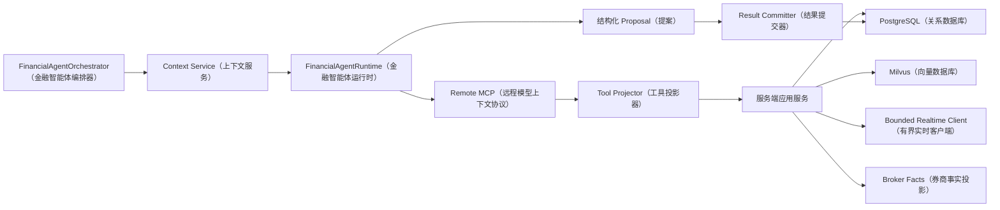

# Agent MCP（智能体模型上下文协议）全局工具与数据能力设计方案

> 一句话定位：本文说明三个 Agent（智能体）怎样安全、逐步地读取服务端数据。任务准备、正式结果保存和系统治理也会说明，但它们不是提供给模型调用的 MCP（模型上下文协议）工具。

## 1. 先用一分钟理解 MCP（模型上下文协议）

Agent（智能体）运行在本地 WSL（Windows Linux 子系统）或服务器 Worker（工作进程）中。市场数据、观点、记忆、账户和订单事实都在服务器。

Agent（智能体）不直接连接 PostgreSQL（PostgreSQL 关系数据库）、Milvus（Milvus 向量数据库）、同花顺接口或券商，而是连接服务器提供的远程 MCP（模型上下文协议）：

```text
Agent Runtime（智能体运行时）
→ 远程 MCP（模型上下文协议）
→ 服务端应用服务
→ PostgreSQL（关系数据库）/ Milvus（向量数据库）/ 有界实时接口 / 券商事实投影
```

模型不会一次拿到全部数据。它先看到摘要和入口，对某个方向感兴趣以后再逐层打开：

```text
概览
→ 数据域或对象列表
→ 单个对象
→ 历史、组成或计算结果
→ 精确市场记录、Card（证据卡片）、Edge（关系边）或正式原文
```

这就是本文最重要的两个原则：

1. Agent（智能体）只通过远程 MCP（模型上下文协议）读取业务数据；
2. 数据由浅入深提供，不把 WebUI（网页用户界面）的大而杂接口直接塞给模型。

## 2. 一次运行中，模型到底能做什么

一次 Agent（智能体）运行分成四步：

```text
系统准备任务
→ 模型调用只读工具进行判断
→ 系统校验并保存模型输出
→ 系统事后维护经验、权限和恢复状态
```

只有第二步需要把 MCP Tool（模型上下文协议工具）提供给模型。

| 步骤 | 谁负责 | 做什么 | 模型能否直接调用 |
|---|---|---|---|
| 准备任务 | FinancialAgentOrchestrator（金融智能体编排器）和 Context Service（上下文服务） | 确定角色、任务、运行模式、账户、初始上下文和权限；历史重放另设时间边界 | 不能 |
| 读取数据 | 当前 Role Agent（角色智能体） | 搜索、打开、下钻和验证本次需要的事实 | 可以，只读且有界 |
| 保存结果 | Result Committer（结果提交器） | 检查证据、版本、状态、权限和重复提交，再保存正式结果 | 不能；模型只返回结构化 Proposal（提案） |
| 系统治理 | Policy Engine（策略引擎）和确定性服务 | 经验晋升/失效、限额发布、恢复、冲正和权限调整 | 不能 |

因此，MCP Server（模型上下文协议服务端）真正注册给模型的工具，默认都是读取工具。

任务准备、结果保存和治理可以与 MCP Server（模型上下文协议服务端）部署在同一个服务进程，也可以复用同一套 Repository（数据仓储访问层），
但它们是宿主程序调用的内部应用能力，不应伪装成模型可以调用的 MCP Tool（模型上下文协议工具）。

### 2.1 用 Research（研究）运行举例

```text
盘前定时事件到达
→ Orchestrator（编排器）准备研究任务和运行模式
→ Runtime（运行时）只把研究读取工具注册给模型
→ 模型打开市场、观点、持仓、记忆和证据
→ 模型返回当前研究报告提案
→ Result Committer（结果提交器）校验后保存
→ 后续结果出来以后，治理服务再评估经验候选
```

模型不能自己切换角色、账户和运行模式，也不能调用“保存观点”“晋升经验”或“修改限额”。

## 3. Tool Projector（工具投影器）做什么

同一套服务端可以实现很多读取能力，但每次模型只能看到本角色、本任务、本账户和本次授权需要的子集。

Tool Projector（工具投影器）是确定性程序。它根据经过签名的 Run Authorization（单次运行授权）生成工具白名单。

例如：

```text
role = research（研究）
task = market_review（市场复核）
```

模型可以看到市场、证据、观点、研究持仓和研究经验读取工具；看不到组合提交、风险评估、执行计划、订单、限额修改和券商能力。

Trading Agent（交易智能体）也分阶段投影：

```text
风险复核任务
→ 只能读取意图、风险、限额和账户状态
→ 不提供执行和订单工具

执行管理任务
→ 必须绑定有效 Risk Decision（风险决策）
→ 只提供当前计划、标的、订单和成交的有界读取工具
```

模型不能通过工具参数自行修改 `role`（角色）、tenant（租户）、account（账户）或 run mode（运行模式）。历史重放边界同样来自签名授权。

## 4. 正式部署方式



关键边界：

- 本地只需要 MCP URL（模型上下文协议服务地址）、认证和运行请求，不需要启动本地业务 API（应用程序编程接口）；
- MCP（模型上下文协议）和 WebUI API（网页用户界面应用程序编程接口）是两个消费者接口，不互相调用；
- 现有 HTTP API（超文本传输应用程序编程接口）只用于调研真实返回数据，不是 Agent（智能体）的正式数据上游；
- 服务端应用服务读取权威数据库和向量库，不能把表名、任意 SQL（结构化查询语言）或数据提供方原始载荷暴露给模型；
- Research（研究）临时探索股票或 ETF（交易型开放式指数基金）时，默认调用有界实时接口，不要求对象已在跟踪列表；
- 券商写操作只能经过 Order Gateway（订单网关），普通 MCP（模型上下文协议）读取工具不能调用券商。

## 5. 所有工具都要遵守“由浅入深”

所有角色使用相同的读取节奏：

```text
Summary/List（摘要/列表）
→ Open（打开单个对象）
→ Detail/History（详情/历史）
→ Exact Evidence（精确证据）
```

统一规则：

- 列表默认只返回少量排序结果、摘要、稳定句柄和允许的下一步；
- 大排行、成分、历史、正文、订单和成交必须分页；
- 打开一个对象不能顺便返回整个数据域；
- 初始上下文只放摘要和异常，不放全部持仓、订单、新闻或历史；
- 每次运行都有工具次数、文本长度、时间和实时请求预算；
- 服务端给出的下一步只是可用导航，不强迫 Agent（智能体）继续查询。

## 6. 三个 Agent（智能体）分别需要什么工具

### 6.1 Research（研究）读取工具

Research（研究）需要最宽的数据视野，但仍然逐层查询。

| 工具层 | 代表性工具 | 返回什么 |
|---|---|---|
| 数据目录 | `research_data_catalog_open`（打开研究数据目录） | 所有可用数据域、覆盖范围、时间、新鲜度、质量和入口状态 |
| 市场变化简报 | `market_change_brief_open`（打开市场变化简报） | 一次返回统一基线对比、相关维度、质量阻塞和有界证据；用于普通复核，不能替 Agent 形成观点 |
| 市场概览 | `market_frame_open`（打开市场框架）、`market_dimension_open`（打开市场维度） | 需要自定义研究路径时读取最新市场概览、数据健康和单个维度 |
| 数据域和对象 | `market_domain_open`（打开市场数据域）、`market_instrument_open`（打开标的） | 数据域摘要、排行、对象详情、组成和当前状态 |
| 临时实时标的 | `market_instrument_realtime_open`（打开实时标的） | 直接查询同花顺上游；用 `fields`（字段组）分别选择行情、走势、业绩、持仓、配置、规模、基金经理、规则、公告或新闻，单次最多四组；不读取数据库和跟踪列表 |
| 历史 | `market_instrument_history`（打开标的历史）及各域历史工具 | 指定时间范围的历史和比较基准 |
| 研究状态 | `research_current_report_open`（打开当前研究报告）、`research_view_list/open`（列出/打开研究观点） | 当前报告、有效观点、主张、预测和失效条件 |
| 研究质量 | `research_quality_list`（列出研究质量）、`research_quality_open`（打开研究质量） | 历史总分、分项分、硬性失败、改进动作、证据与工具覆盖、结果校准分 |
| 持仓暴露 | `research_exposure_summary_open`（打开研究持仓暴露摘要）、`research_position_open`（打开研究持仓）、`research_position_performance_open`（打开持仓表现） | 只读持仓、观点关联、成本、盈亏、基准和账户状态 |
| 精确证据 | 图谱、外部原文和 `market_evidence_open`（打开市场证据） | 实际 Card（证据卡片）、Edge（关系边）、正式正文和市场记录 |
| 运行证据账本 | `agent_evidence_ledger_open`（打开智能体证据账本） | 服务端根据真实工具结果维护的引用、调用状态和响应摘要；模型不能自行添加 |

Research Data Catalog（研究数据目录）必须覆盖 Research（研究）文档列出的全部已采集数据范围，包括 A 股、板块、股票、ETF（交易型开放式指数基金）、期货、黄金、
美股、基金、新闻研报、情绪、宏观、标的资料和数据健康。暂未工具化的数据域也要明确标记 `planned`（计划中）或 `unavailable`（不可用），
不能让模型误以为数据不存在。

#### Research Exposure Pack（研究持仓暴露包）

初始研究上下文只返回账户状态、持仓数量、主要暴露、异常盈亏、无有效观点关联的持仓数量和下钻句柄。

打开单个持仓后至少返回：

- 账户快照、截止时间、币种、对账和冻结状态；
- 持仓、数量、市值、组合占比和平均成本；
- 首次/最近建仓时间和持有期；
- 关联的 View/Revision（观点/修订版本）及关联是否有效；
- 建仓以来和当前观点版本生效以来的表现；
- 已实现/未实现盈亏、比较基准和超额表现；
- 数据来源、新鲜度和质量问题。

工具必须区分：

- `available`（可用）：账户和持仓数据正常；
- `empty`（为空）：账户真实存在，但当前没有持仓；
- `unavailable`（不可用）：账户未接入、无权限、快照缺失或服务故障。

盈亏只能触发复核和反思，不能作为市场因果证据，也不能让 Research（研究）获得仓位或订单权限。

### 6.2 Portfolio（组合管理）读取工具

Portfolio（组合管理）的工具必须使用跨资产口径。候选、持仓和意图以通用 `instrument_id`（标的标识符）、
`asset_type`（资产类型）、market（市场）和 currency（币种）表达，不能围绕基金代码或基金专属字段设计底层契约。
同一套工具要能处理股票、ETF（交易型开放式指数基金）、场外基金、期货、黄金、美股和现金。

| 工具层 | 需要读取什么 |
|---|---|
| 组合上下文 | 有效观点、当前研究报告、组合快照、现金、冻结、待成交活动和组合经验 |
| 候选 | 候选列表、单个候选、表达机制和替代表达 |
| 组合状态 | 持仓、成本、盈亏、权重、现金、订单占用和组合漂移 |
| 暴露和适配 | 行业/主题/因子/币种暴露、相关性、集中度、流动性、费用和情景结果 |
| 历史结果 | 原组合意图、实际结果、未交易机会和组合经验案例 |

代表性读取契约可以包括：

- `portfolio_context_open`（打开组合上下文）；
- `portfolio_candidate_list/open`（列出/打开组合候选）；
- `portfolio_snapshot_open`（打开组合快照）；
- `portfolio_exposure_open`（打开组合暴露）；
- `portfolio_scenario_open`（打开组合情景结果）；
- `portfolio_outcome_open`（打开组合结果）。

Portfolio Intent（组合意图）、Research Request（研究请求）和 View Challenge（观点质疑）由模型放在结构化输出中，
再由 Result Committer（结果提交器）校验保存，不通过模型写工具直接入库。

### 6.3 Trading（交易）读取工具

Trading（交易）必须按任务阶段提供不同工具。

风险复核阶段读取：

- Portfolio Intent（组合意图）；
- 调整前后的全组合风险；
- 账户、现金、持仓、冻结和对账状态；
- 版本化限额和压力情景；
- 市场流动性、风险事件和交易经验。

执行管理阶段读取：

- 有效 Risk Decision（风险决策）和获准边界；
- 当前可交易状态、盘口、成交量和波动；
- 活动 Execution Plan（执行计划）；
- 本计划的订单、成交、拒单、撤单和剩余数量；
- 费用、滑点、冲击成本和执行经验。

代表性读取契约可以包括：

- `trading_context_open`（打开交易上下文）；
- `risk_limit_open`（打开风险限额）；
- `risk_snapshot_open`（打开风险快照）；
- `risk_stress_open`（打开压力结果）；
- `risk_decision_open`（打开风险决定）；
- `execution_context_open`（打开执行上下文）；
- `tradable_state_open`（打开可交易状态）；
- `execution_plan_open`（打开执行计划）；
- `order_status_list/open`（列出/打开订单状态）；
- `fill_list/open`（列出/打开成交）。

Risk Assessment（风险评估）、Execution Plan（执行计划）和 Order Intent（订单意图）仍由模型结构化输出，服务端分阶段校验和保存。

### 6.4 运行状态读取工具

长时间研究或执行任务还需要两项公共只读能力：

| 工具 | 作用 |
|---|---|
| `agent_run_state_open`（打开智能体运行状态） | 查看本次运行的任务、预算、已完成步骤和可恢复检查点 |
| `agent_evidence_ledger_open`（打开智能体证据台账） | 查看本次运行实际打开过哪些证据及其版本 |

运行检查点由 Runtime（运行时）自动保存，只记录研究问题、假设状态、已打开对象、未解决冲突和预算等可审计结构，
不保存模型隐藏推理。证据台账也由服务端自动登记，模型不能伪造“已经读取过”的证据。

## 7. 公共证据工具

三个角色共用一套底层证据服务，但只投影当前任务需要的部分。

| 能力 | 主要读取工具 | 硬边界 |
|---|---|---|
| 知识图谱 | 关系搜索、Card/Edge（证据卡片/关系边）打开和扩展、Community（图谱社区）打开 | Community（图谱社区）只能导航；关系主张必须打开 Edge（关系边） |
| 外部研究 | 网页搜索/读取、代码仓库搜索/结构/读取、正式内容读取 | 搜索摘要不能当证据，必须打开正文 |
| 市场证据 | `market_evidence_open`（打开市场证据） | 返回精确对象、指标、事实时间、截止时间和口径 |
| 业务对象 | `business_object_open`（打开业务对象）或角色专用打开工具 | 返回稳定标识符、版本和状态，不返回任意数据库行 |

正式主张只能引用本次运行实际打开的证据；实时运行优先最新可用证据，历史重放不得越过重放边界。

## 8. 公共记忆和结果工具

记忆底层只实现一套 Role Memory Service（角色经验记忆服务），但三个角色的命名空间、评测集和权限互相隔离。

模型可见的读取工具：

| 工具 | 作用 |
|---|---|
| `role_memory_search`（搜索角色经验） | 按当前角色、对象、市场状态和有效期召回少量经验；历史重放按边界恢复当时有效经验 |
| `role_memory_open`（打开角色经验） | 打开经验结论、适用条件、证据、反例和失效条件 |
| `role_memory_case_open`（打开经验案例） | 打开经验关联的原决策和真实结果 |
| `role_outcome_search/open`（搜索/打开角色结果） | 读取本角色正式决策对应的实际结果 |

模型不直接调用“提交候选”或“晋升经验”工具：

- Memory Candidate（记忆候选）放在本次结构化输出中，由结果提交器保存；
- 去重、证据检查、反事实检查和历史重放由治理服务完成；
- 达到策略阈值后，Policy Engine（策略引擎）自动晋升、降权或失效；
- 当前运行刚产生的候选不能立即变成当前运行可读的正式经验。

Research（研究）的工作、事实、观点、结果和经验五层记忆仍然保存在各自权威位置，不建立一张“万能记忆表”。

## 9. 每个工具都必须返回哪些时间和质量信息

市场和外部事实工具至少返回：

- `as_of`（事实时点）和查询时间；历史重放结果另带重放边界；
- 市场、会话、交易日和对象；
- 数据提供方、数据类型、指标、单位和计算口径；
- 来源时间、观测时间、采集时间和报告期；
- 是新增事实、沿用旧值还是补历史；
- 新鲜度、完整性、覆盖、截断和质量问题；
- 读取路径是数据库、实时上游还是混合；
- 如果降级，使用的旧值来自什么时间；
- 稳定句柄、Evidence Locator（证据定位符）和允许的下一步；
- 不可用、错误和降级原因。

账户和持仓工具还要返回账户快照、币种、对账、冻结、收益窗口和观点关联状态。

Evidence Locator（证据定位符）必须能够重新定位到数据集、对象、字段、事实时间、版本和来源。账户盈亏定位符只能证明账户结果，
不能被登记为市场因果证据。

完整 Evidence Locator 不直接重复暴露给模型。Agent Runtime（智能体运行时）为本次 Run 建立
短引用表，模型使用 `market_ref:M1` 一类短引用探索和提交，确定性边界负责恢复完整定位符后再
执行证据审计与持久化。触发器、市场框架和维度导航同样采用模型侧短引用与秒级时间展示；完整
ID、微秒时间和版本身份只保留在服务端可信状态中。

## 10. 数据从哪里读取

| 数据 | 默认来源 | 例外 |
|---|---|---|
| 已持续采集的市场和业务事实 | PostgreSQL Repository（PostgreSQL 数据仓储访问层） | 用于市场全景、历史比较、观点记忆和事件触发；实时运行读取最新可用版本 |
| Card、Chunk、经验等可读语义内容 | MilvusClient（Milvus 客户端） | PostgreSQL 只保存关系和指针；Milvus 支持语义搜索和按稳定标识符取回 |
| 临时股票/ETF 探索 | 同花顺有界实时接口 | 不查跟踪列表和市场数据库；先概览，Agent 判断重要后再取详情 |
| 券商订单、成交、现金和持仓 | 已持久化的券商回报事实 | Operations Service（运营服务）受控查询券商；Agent（智能体）只读投影 |
| 历史重放 | 带截止时间的 PostgreSQL/Milvus 历史视图 | 禁止用后来修订或现场补取的数据替代当时事实 |
| WebUI 组装结果 | 不进入 Agent（智能体）数据路径 | MCP（模型上下文协议）不回调 Dashboard API（仪表盘应用程序编程接口） |

实时运行不再把整次研究冻结在启动时刻。模型每次查询都获得当时最新可用数据，但不能指定数据提供方私有协议、任意网址、任意 SQL（结构化查询语言）或券商账户。历史重放仍使用固定边界并禁用实时上游。

## 11. 权限怎样控制

读取权限至少分为：

- 市场读取；
- 证据读取；
- 业务状态读取；
- 研究持仓暴露读取；
- 角色经验和结果读取。

权限来自本次签名授权，不来自模型参数。

模型没有以下直接权限：

- 正式提交研究观点、组合意图、风险评估、执行计划或订单；
- 晋升、删除或覆盖正式经验；
- 修改限额、账户范围和角色；
- 冲正、恢复、解除冻结或修改对账结果；
- 直接调用券商。

正式业务输出由 Runtime（运行时）接收模型的结构化 Proposal（提案），再交给相应 Result Committer（结果提交器）。

需要阻断的情况包括：

- 模型尝试跨角色、跨账户或跨租户读取；
- 关键数据过期、截断或来源不明；历史重放还检查越界；
- 正式主张引用了本次没有打开的证据；
- 运行中账户、观点、意图或限额发生不兼容版本变化；
- 风控、订单网关或对账不可用；
- 模型输出了本角色无权提出的业务对象。

## 12. 分阶段建设

### M0（第零批）：公共底座

- 远程 Streamable HTTP MCP（可流式超文本传输模型上下文协议）、认证和签名授权；
- Tool Projector（工具投影器）、统一结果信封、分页、实时/重放时间策略和证据台账；
- PostgreSQL、Milvus、实时路由和数据质量门禁；
- shadow/debug/replay（影子/调试/历史重放）与生产写入隔离。

### M1（第一批）：Research（研究）闭环

- 自动准备研究上下文，不依赖人工 JSON（JSON 数据格式）；
- Research Data Catalog（研究数据目录）和 Market State Frame（市场状态框架）；
- 目录覆盖 A 股、板块、股票、ETF（交易型开放式指数基金）、期货、黄金、美股、基金、新闻、
  研报、情绪、宏观、标的资料和数据健康，并支持主题、维度、数据域和精确字段逐层下钻；
- 当前报告、观点、结果、研究经验和精确证据读取；
- 研究结构化输出、结果提交和证据校验；
- 先定义 Research Exposure Pack（研究持仓暴露包）契约，账户未接通时明确返回不可用。

### M2（第二批）：Portfolio（组合管理）闭环

- 账户、持仓、现金、冻结和待成交活动；
- 候选、暴露、相关性、集中度、流动性和情景结果；
- 组合意图、研究请求、观点质疑和组合经验闭环；
- 同时启用真实 Research Exposure Pack（研究持仓暴露包）和持仓—观点关联。

### M3（第三批）：Trading（交易）闭环

- 意图、组合风险、限额、压力情景、账户健康和风险决定；
- 执行上下文、可交易状态、活动计划、订单和成交；
- 风险复核与执行管理的互斥工具投影；
- 订单网关、幂等、过期、模拟券商和交易经验闭环。

### M4（第四批）：确定性运营闭环

- 券商事实、内部状态、对账差异、异常、冻结和自动恢复；
- Agent（智能体）只读运营状态，运营写能力不进入模型工具；
- 完成端到端模拟和三个角色的结果治理。

## 13. 当前基线和缺口

当前已经完成 M0（第零阶段）和 M1（第一阶段）：

- OpenAI Agents SDK（OpenAI 智能体软件开发工具包）Runtime（运行时）、模型接入和远程 MCP（模型上下文协议）连接；
- 静态客户端认证加逐 Run Authorization（单次运行授权），服务端固定角色、任务、运行模式，历史重放固定时间边界，
  运行模式、账户范围、工具白名单和过期时间；
- 自动 Context Prepare（上下文准备），CLI（命令行界面）和定时任务不依赖人工 JSON（JSON 数据格式）；
- Research Data Catalog（研究数据目录）映射十四个真实持久化数据域和全部已采集快照类型；
- 基于交易所日历和明确指标口径的 Market State Frame（市场状态框架）、历史可比基线和显著变化；
- 主题、维度、数据域、板块、标的和历史的有界下钻，以及字段级 Evidence Locator（证据定位符）；
- 图谱搜索、Card/Edge/Community（证据卡片/关系边/图谱社区）打开；
- 外部搜索、正文和代码仓库读取；
- 当前研究报告、观点修订、预测、结果、角色经验和经验案例读取；
- 服务端运行记录、工具调用记录和只登记实际打开证据的 Evidence Ledger（证据台账）；
- 模型只见 Research Read Tools（研究读取工具），准备、提交和中止契约只供编排器与运行时调用；
- 服务端 Proposal Commit（提案提交）核对签名身份、证据台账和业务版本，只有生产运行可以发布；
- Research Quality Evaluator（研究质量评估器）在提案提交后使用服务端证据台账独立评分，评分只用于长期查询、版本比较和真实结果校准，不阻断研究结论；
- 盘前、盘中和盘后三个独立 Research（研究）计划，人工调试和自动任务复用同一运行时；
- Research Exposure Pack（研究持仓暴露包）已经提供稳定读取契约；券商事实投影未接入时明确
  返回 `unavailable`（不可用），不把缺失数据伪装成空仓。

后续阶段边界：

- Portfolio（组合管理）和 Trading（交易）的业务对象、工具、调度和确定性门禁；
- 券商账户事实投影、组合、风控、订单网关和运营对账属于 M2 至 M4（第二至第四阶段）；
- Research Exposure Pack（研究持仓暴露包）将在 M2（第二阶段）接入真实账户后从
  `unavailable`（不可用）切换为 `available`（可用）或 `empty`（空仓）。

因此当前系统可以描述为“Research Agent（研究智能体）远程 MCP（模型上下文协议）闭环已经完成”，
但不能描述成 Portfolio（组合管理）、Trading（交易）和自主交易全链路已经完成。

## 14. 验收标准

- 模型只看到本角色、本任务、本账户和本次授权所需的只读工具；
- 任务准备、正式结果保存和治理不注册成模型工具；
- 本地 Agent（智能体）只配置远程 MCP（模型上下文协议），不配置数据库、向量库、数据提供方和券商；
- 所有工具返回有界结果、稳定句柄、明确时间、质量和证据定位；
- Research（研究）可以发现几乎全部有效数据域，并完成从目录到精确证据的下钻；
- Research Exposure Pack（研究持仓暴露包）区分可用、空仓和不可用，盈亏不会成为市场因果证据；
- Portfolio（组合管理）和 Trading（交易）只在相应权威数据和确定性门禁完成后开放；
- Trading（交易）的风险复核和执行管理使用不同工具投影；
- WebUI API（网页用户界面应用程序编程接口）不是 MCP（模型上下文协议）上游；
- 历史重放不读取未来事实、观点、结果和经验；
- 文档、工具注册表、部署和代码能够明确区分已完成、部分完成和目标能力。

## 15. 相关文档

- [《交易型多 Agent（智能体）决策架构总纲》](./3.%20交易型多Agent决策架构总纲.md)
- [《Research Agent（研究智能体）投资观点形成与持续演化设计方案》](./4.%20Research%20Agent研究智能体设计方案.md)
- [《Portfolio Agent（组合管理智能体）设计方案》](./5.%20Portfolio%20Agent组合管理智能体设计方案.md)
- [《Trading Agent（交易智能体）设计方案》](./6.%20Trading%20Agent交易智能体设计方案.md)
- [《Market Data Observatory Agent MCP（市场数据观测站智能体模型上下文协议）数据能力交接说明》](../../6.%20使用说明/4.%20Market%20Data%20Observatory%20Agent%20MCP数据能力交接说明.md)
