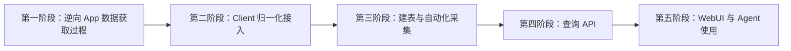
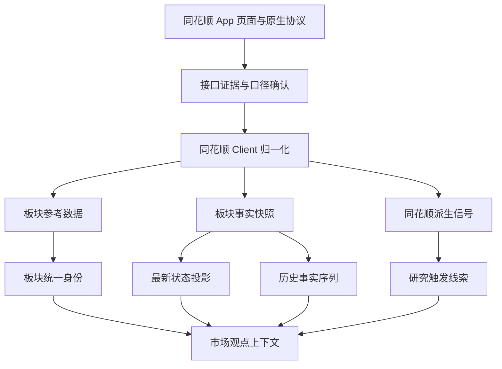

# 同花顺 App 板块市场数据对接设计方案

## 1. 文档定位

本文定义系统如何接入、保存和使用同花顺 App 板块页面中的客观市场数据，为市场观点形成提供大盘与具体标的之间的中间认知层。

本文是设计方案，重点回答：

- 为什么需要板块市场数据；
- 需要接入哪些能力；
- 同花顺数据与其他来源如何划分边界；
- 板块数据如何形成连续历史；
- Agent 如何使用这些数据形成和验证市场观点；
- 哪些同花顺派生指标只能作为研究线索，不能作为事实结论。
- 整体建设必须按照什么顺序推进，以及每个阶段满足什么条件后才能进入下一阶段。

本文定义建设阶段和阶段门禁，但不展开具体协议字段、代码文件、数据库 DDL 和任务实现细节。协议、请求参数、逆向证据、Client 实现和调度任务分别由现有逆向记录和后续实施方案负责。

## 2. 背景问题

系统已经能够持续采集 A 股大盘状态、市场广度、核心指数、资金、情绪、跨市场、估值和债券数据，也能够通过 Watchlist 持续跟踪具体股票、基金、ETF 和指数。

这两层之间仍然缺少板块层：

```text
大盘状态
  ↓
行业、概念、风格和地域板块
  ↓
ETF 与具体股票
```

只观察大盘，无法知道市场正在交易哪些方向；只观察个股，又无法区分个股独立行情、行业共振和全市场风险偏好变化。

同花顺 App 板块页提供了热点、板块统计、资金、轮动、景气和商品联动等数据。这些数据能够帮助系统回答：

- 当前市场注意力集中在哪些方向；
- 上涨是个别股票驱动，还是板块内部广泛扩散；
- 价格变化是否获得资金确认；
- 热点是刚刚启动、持续强化、横向扩散还是正在衰退；
- 商品、行业、ETF 和具体股票之间是否出现一致响应。

## 3. 核心设计判断

### 3.1 板块数据属于公共市场观测

板块不是可交易标的，不进入 Agent Watchlist。

- 公共市场观测层持续采集全部有效板块；
- Watchlist 只管理具体股票、基金、ETF/LOF 和指数；
- Investment View 形成和验证时，同时读取公共板块数据与具体标的数据。

### 3.2 页面展示不是数据契约

系统不以复制同花顺页面为目标，而是接入页面背后的事实和信号。页面文案、卡片顺序和颜色不能替代接口字段、统计口径和来源时间。

### 3.3 同源优先，禁止静默混用口径

同花顺页面存在目标能力时，优先定位并使用同花顺 App 实际调用的数据源。

如果某项能力必须使用其他来源降级，需要明确记录：

- 原始来源；
- 降级原因；
- 分类和统计口径差异；
- 是否允许和同花顺序列连续比较。

行业行情来自同花顺、概念行情来自其他来源的结果，不能在没有身份映射和口径说明的情况下组成同一排名或连续序列。

### 3.4 快照优先，保留演化过程

板块数据的价值主要来自变化，而不是某个时刻的最新值。排行、热度、资金和景气数据必须保留历史快照，不能只维护最新投影。

最新投影用于页面和 Agent 快速读取；历史事实用于趋势、轮动、连续性和事件前后比较。

### 3.5 来源事实与派生信号严格区分

板块涨跌、成交、资金、成分股和分钟行情属于可核验市场事实。

同花顺的热度、景气度、机会值和商品影响结论属于来源方派生信号。系统可以保存并用于触发研究，但必须保留来源与口径，不能包装成系统已经独立证明的事实。

## 4. 建设顺序与阶段门禁

同花顺 App 板块数据接入必须按照以下顺序推进：



任何阶段都不能用模拟数据、猜测字段或临时直连上游的方式绕过前一阶段门禁。

### 4.1 第一阶段：逆向 App 数据获取过程

第一阶段只负责把目标数据的真实获取链路研究清楚并逐项打通，暂不接业务 Client、数据库、定时任务和 WebUI。

#### 4.1.1 真机与虚拟机的职责边界

真机和服务器 Android 虚拟机承担不同职责，不能混用完成标准：

| 环境 | 正式职责 | 不承担的职责 |
|---|---|---|
| 已 Root 真机 | 页面操作、抓包、Hook、调用链定位、字段字典分析、页面值核对和协议研究 | 不作为生产定时采集节点，不要求长期在线 |
| 服务器 Android 虚拟机 | 部署同花顺 App、原生 Bridge 和无人值守调用服务，执行生产环境的持续采集 | 不代替真机完成首次页面语义和协议研究 |

真机是逆向研究的事实基准。需要在真机中观察同花顺 App 实际页面行为，保存同一时刻的页面、请求、响应和 Hook 证据，确认字段语义后才能形成接口契约。

虚拟机是最终生产运行环境。真机中已经定位的能力必须迁移到虚拟机，并验证：

- 相同 App 版本和协议在虚拟机中可以调用；
- 不依赖 Activity、WebView、人工点击和前台常驻；
- App 进程、Bridge 或虚拟机重启后能够自动恢复；
- 固定路由、订阅和资源清理不会串包或泄漏；
- 多次调用结果与真机同一接口的字段和口径一致；
- 设备离线、App 崩溃、登录失效和上游超时能够被监控与告警；
- 服务器重启后虚拟机和采集服务能够自动启动。

某项能力只在真机上调用成功，不代表已经具备生产能力；只有完成“真机定位和口径确认”以及“虚拟机无人值守重放和稳定性验收”两部分，才算第一阶段真正打通。

生产采集不得依赖 USB 连接真机、人工保持屏幕常亮或人工恢复 App。真机只在接口变化、字段异常和 App 升级时重新参与研究与回归验证。

需要针对本文第六章列出的每项能力完成：

1. 在真机或已验收的 Android 运行环境中定位页面实际请求；
2. 判断请求属于公开 HTTP、WebView、App 原生协议还是其他通道；
3. 确认请求参数、鉴权上下文、分页或订阅方式、返回字段和错误语义；
4. 确认来源时间、交易日期、数值单位和统计口径；
5. 在脱离具体页面操作的条件下完成稳定重放；
6. 将接口结果与同一时刻的 App 页面逐字段核对；
7. 保存可复核的请求、响应、版本和运行环境证据；
8. 明确接口能否脱离 App、是否依赖 Android Bridge，以及无人值守运行边界。

第一阶段必须覆盖：

- 热门板块；
- 板块统计及全部分类、排序维度；
- 行业、概念和地域板块资金；
- 热点轮动；
- 行业机会榜；
- 板块景气度；
- 商品联动；
- 板块成分、相关 ETF 和页面使用的关联信息。

如果某项必需数据暂时无法获得，该项继续作为第一阶段阻塞项，不能直接进入后续业务接入，也不能用近似字段冒充。只有经过设计评审明确移出本期范围，或者批准使用口径可验收的替代来源后，才能解除阻塞；替代来源同样必须完成本阶段的接口和口径验收。

进入第二阶段前必须满足：

- 所有本期目标能力均已打通；被确认无法获取的能力已经过设计评审移出本期范围或正式批准替代来源，不允许静默遗留；
- 核心字段与 App 页面口径一致；
- 接口调用不依赖人工点击页面；
- 原生协议能力已经具备可重复调用和资源清理方案；
- 所有计划进入生产的能力均已从真机研究结果迁移到服务器虚拟机，并通过无人值守重放；
- 生产调用不依赖真机在线、USB 连接或人工保活；
- 接口证据已写入逆向记录。

### 4.2 第二阶段：Client 归一化接入

第二阶段把已经验收的真实接口封装到同花顺 Client。Client 只表达上游能力和统一返回契约，不负责数据库写入、任务调度、观点计算和页面展示。

Client 需要完成：

- 请求参数和身份标准化；
- 上游字段到稳定业务字段的映射；
- 时间、单位、空值和错误状态标准化；
- 来源派生信号和客观事实的类型隔离；
- App 原生 Bridge 的超时、串行、清理和重连处理；
- 真实接口集成测试和 App 同时点对照测试；
- 接口变更时的结构异常检测。

进入第三阶段前必须满足：

- 每项 Client 方法均通过真实上游调用；
- 返回结构不依赖页面文案解析后的猜测；
- 空数据、闭市、延时、鉴权失败和协议异常能够区分；
- 调用 Client 不会产生数据库或任务副作用。

### 4.3 第三阶段：建表、入库与自动化采集

第三阶段将 Client 能力接入正式的数据采集系统，包括数据模型、数据库迁移、采集任务、调度、断点、幂等和运行观测。

该阶段需要完成：

- 为板块参考数据、历史事实快照和来源派生信号确定存储边界；
- 创建或扩展正式数据表并提供可回滚迁移；
- 建立板块统一身份和提供方身份映射；
- 建立异步采集任务及交易时段调度；
- 保存来源时间、采集时间、交易日期、单位、口径和来源版本；
- 实现幂等写入，保留排行、热度、资金和轮动历史；
- 区分成功空增量、部分成功、真实失败和不可回填缺口；
- 建立任务运行审计、失败告警和来源健康状态；
- 支持服务重启后的日级追赶和盘中缺口标记。

所有页面和查询请求都不能直接触发同花顺上游采集。上游读取由后台任务完成，查询链路只读取数据库和最新投影。

进入第四阶段前必须满足：

- 定时任务能够无人值守连续运行；
- 数据库可以读取最新状态和历史序列；
- 重复调度不会制造重复事实；
- 上游失败不会覆盖最后一份有效数据；
- 采集新鲜度、缺口和错误可以被观测。

### 4.4 第四阶段：查询 API

第四阶段在稳定入库数据之上提供服务端查询接口。API 只读取数据库，不把同花顺 Client 暴露为同步代理。

API 需要覆盖：

- 板块市场概览；
- 完整分类和指标排行；
- 单个板块详情；
- 行情、资金、热度、排名和轮动历史；
- 板块成分、相关 ETF 和商品关联；
- 数据来源、口径、新鲜度及缺口；
- 分页、时间范围、结果数量限制和响应压缩。

进入第五阶段前必须满足：

- API 返回值与数据库事实一致；
- 大结果集支持分页和压缩，不能一次返回无边界的全量历史；
- 接口能明确表达延时、缺失和来源降级；
- API 测试不依赖同花顺上游在线。

### 4.5 第五阶段：WebUI 与 Agent 接入

WebUI 和 Agent 共用第四阶段的应用服务与数据语义，不能分别实现另一套板块计算逻辑。

WebUI 负责展示：

- 热门板块；
- 板块统计；
- 板块资金；
- 热点轮动；
- 行业机会；
- 板块景气度；
- 商品联动；
- 来源、新鲜度和历史趋势。

Agent 负责按研究问题读取板块概览、具体板块及历史变化，并与新闻图谱、ETF、Watchlist 标的和持仓共同形成观点。

正式 Agent 入口为三个数据库只读 MCP Tool：

- `market_sector_overview`：读取有界的板块概览；
- `market_sector_rankings`：按数据类型、指标和板块分类读取受限排行；
- `market_sector_open`：按同花顺板块代码打开最新状态和受限历史。

三个 Tool 均返回 `upstream_requested=false`，并在交付 Agent 前删除原始指标字典、长区间数组和其他存储诊断字段。Agent 请求不会同步调用 Android 虚拟机，也不会一次接收全部板块历史。

第五阶段验收不能只检查页面是否有数据，还必须确认：

- WebUI 展示值与查询 API 一致；
- 页面刷新不直接请求同花顺；
- Agent 可以区分客观事实和同花顺派生信号；
- Agent 能按需读取，不会把全部板块历史一次输入模型；
- WebUI 与 Agent 对同一板块使用相同身份和口径。

## 5. 当前能力基线

| 能力 | 当前状态 | 当前基础 | 主要缺口 |
|---|---|---|---|
| 行业板块排行 | 已覆盖 | App 原生页 `1209`，支持涨跌幅、涨速、量比和涨停数 | 继续补充页面其余排序指标 |
| 概念板块排行 | 已覆盖 | App 原生页 `1297`，支持涨跌幅、涨速、量比和涨停数 | 继续补充页面其余排序指标 |
| 风格板块排行 | 已覆盖 | App 原生页 `4046`，支持涨跌幅、涨速、量比和涨停数 | 继续补充页面其余排序指标 |
| 地域板块排行 | 已覆盖 | App 原生页 `1337`，支持涨跌幅、涨速、量比和涨停数 | 继续补充页面其余排序指标 |
| 全部板块排行 | 已覆盖 | App 原生页 `1358`；涨停数使用四类 Hurricane 分类合并口径 | 少数聚合代码缺少板块名称，需要完善身份映射 |
| 板块资金 | 已覆盖 | 行业、概念和地域资金排名均来自 App 原生协议 | 交易时段连续采集仍需长期运行验收 |
| 热门板块 | 已覆盖 | 概念、行业使用 Hurricane；指数板块使用 App 的 `index_sector` 接口，包含原生排名、涨跌幅和热度 | 读取层自动隔离历史 `tszs` 错误快照 |
| 热点轮动 | 已覆盖 | 行业、概念五类轮动指标及历史周期 | 属于来源派生信号，不作为独立事实 |
| 行业机会榜 | 已覆盖 | 热点、低位和复苏三类机会榜 | 相关 ETF 仍需补齐同源映射 |
| 板块景气度 | 已覆盖 | 原生景气主题、排名和来源字段 | 需继续完善板块统一身份映射 |
| 商品联动 | 已覆盖信号 | 期股、现货、产业三个 Tab 已全量分页入库，并通过原生行情协议补齐关联板块和 ETF 的名称及涨跌幅 | 相关 ETF 与客观商品行情继续由独立事实层确认 |
| 板块成分与相关 ETF | 已覆盖 | 成分股使用 App 原生 Hurricane `sif-constituent-stock` 与 `HQ_BLOCK_CODE` 选择器；热门板块代表 ETF 使用同花顺热榜原始 `etf_name`、`etf_product_id` 和 `etf_market_id` | 成分股按 100 行原生分页，并在每 5 分钟板块核心快照任务中分批补齐；非热门板块没有同花顺代表 ETF 时保持为空，不使用推测映射 |

当前 Client、快照入库、定时任务、数据库只读 API 和板块 WebUI 已接通。生产虚拟机真实验收中，核心板块快照一次写入 `1,165` 条，轮动、机会、景气和商品联动一次写入 `6,093` 条；查询 API 能返回全部五种分类、四种排行、三种资金分类和全部来源信号。上述数量是验收批次结果，不是固定数据契约。

## 6. 目标数据能力

### 6.1 板块身份与分类

系统需要覆盖：

- 行业板块；
- 概念板块；
- 指数板块；
- 风格板块；
- 地域板块；
- 页面提供的其他稳定分类。

每个板块需要拥有独立于提供方的稳定身份，并保存：

- 提供方板块代码和名称；
- 板块分类；
- 名称别名；
- 成分股集合及生效时间；
- 相关 ETF；
- 可确认的父级、相邻或产业链关系；
- 映射状态和来源。

板块名称相同不代表身份相同，成分高度重合也不能自动合并。跨来源映射必须基于提供方代码、名称、成分和时间共同判断。

### 6.2 热门板块

热门板块需要保存：

- 板块身份和分类；
- 当前涨跌幅；
- 来源热度值；
- 当前排名；
- 排名依据；
- 来源时间和采集时间。

热门榜单是市场注意力入口，不直接代表趋势持续，也不能单独构成投资观点。

### 6.3 板块统计

板块统计至少覆盖：

- 涨跌幅和涨速；
- 成交额、成交量和量比；
- 上涨、下跌和平盘家数；
- 涨停和跌停家数；
- 领涨股及其贡献；
- 行业、概念、风格和地域分类排名。

不同排序指标分别保存，不能只保存页面当前选中的 Tab。

### 6.4 板块资金

板块资金需要覆盖：

- 行业、概念和地域资金排名；
- 当前净流入或净流出；
- 净流入排名前端和净流出排名末端，不能只保留正值 Top-N；
- 盘中变化；
- 排名变化；
- 价格和资金方向是否一致；
- 统计口径及单位。

“昨日主力净流入”属于已经结束交易日的事实，不能和当前盘中估算资金合并为同一序列。
同花顺页面按完整降序列表同时展示前三名净流入和末三名净流出。采集端必须保存完整板块列表并记录 `flow_direction` 与方向内排名；WebUI 可以裁剪两端，但数据库和 Agent API 不得丢弃中间数据。

### 6.5 热点轮动

热点轮动需要表达板块在多个观察周期中的状态变化，而不是只保存最近几日的页面文案。

读取和展示必须保留 `板块类型 → 指标 → 交易日 → 排名` 四层结构。概念板块和行业板块不能混排；涨幅、五日涨幅、上涨率、涨停家数和主力净流入不能混用；WebUI 使用日期作为列、名次作为行还原同花顺矩阵。数据库保存全部历史周期，概览接口只限制返回窗口，不改变底层事实。

系统需要能够还原：

- 首次进入热点榜单的时间；
- 连续活跃周期；
- 排名上升、下降和退出；
- 热点从一个板块向相邻板块扩散；
- 价格、资金、热度和成分股广度是否同步；
- 同一主题在不同分类板块中的重叠。

同花顺提供的轮动结果按来源信号保存；系统基于历史快照计算的轮动状态使用独立语义，二者不得混用。

### 6.6 行业机会榜

行业机会榜需要保存同花顺实际返回的：

- 行业名称和身份；
- 实时涨跌幅；
- 机会值；
- 机会值更新时间或连续周期；
- 页面关联的 ETF；
- 来源说明。

机会值是黑盒派生信号，只用于提升研究候选优先级。Agent 必须继续检查板块行情、资金、成分股、新闻事实和估值，不能直接将机会值转换成交易结论。

### 6.7 板块景气度

板块景气度需要保存：

- 主题及其子板块；
- 当前涨跌幅；
- 来源景气或热度值；
- 历史百分位；
- 主要贡献股票；
- 统计窗口和来源时间。

景气度用于判断主题内部是否扩散、是否拥挤，以及行情是否只有少数龙头贡献。

### 6.8 商品联动

商品联动需要拆分为三层：

1. 商品价格、涨跌和期限等客观行情；
2. 同花顺提供的商品影响板块、ETF 映射；
3. 系统根据新闻图谱和市场数据确认的传导关系。

来源方映射只能提出研究方向，不能直接证明商品价格变化已经导致行业利润或股票价格变化。

数据接入必须覆盖 App 的三个 Tab：

- 期股联动读取原生 `sector_goods_futures`；
- 现货联动读取公开 `commodity/list/spot`，按单页 20 条分页；
- 产业联动读取公开 `commodity/list/industry`，按单页 20 条分页；
- 关联板块和 ETF 使用原生行情协议批量补充名称和涨跌幅；
- 数据库保存全部语义唯一记录，WebUI 只对每个 Tab 做有界展示；
- 商品身份必须包含关联资产映射，禁止仅按商品代码覆盖不同的联动对象。

## 7. 数据分层



### 7.1 参考数据

保存板块目录、分类、成分、相关 ETF 和提供方身份。参考数据按有效期管理，不能使用今天的成分解释过去的板块表现。

### 7.2 事实快照

保存板块行情、广度、资金、排行和分钟变化。事实快照是市场确认和历史分析的主要依据。

### 7.3 来源派生信号

保存同花顺热度、机会值、景气度和商品联动信号。每条记录必须明确其来源派生属性。

### 7.4 系统派生状态

系统可以基于历史事实计算持续性、扩散、背离和轮动状态，但必须使用独立结果，禁止回写或覆盖来源原始字段。

## 8. 异步采集与更新策略

所有板块页面和 Agent 查询只读取数据库或最新投影，不在请求链路中直接调用同花顺上游。

建议的目标频率为：

| 数据 | 目标频率 | 交易时段 |
|---|---:|---|
| 板块行情、统计、排行和资金 | 5 分钟 | 连续竞价阶段；完整批次包含 25 个必须串行的原生调用 |
| 热度和景气信号 | 1 至 5 分钟 | 来源有更新时 |
| 热点轮动 | 5 分钟及收盘边界 | 盘中观察与盘后固化 |
| 行业机会榜 | 5 至 15 分钟 | 来源有更新时 |
| 商品联动行情 | 1 分钟 | 对应商品市场开放时 |
| 板块目录、成分和 ETF 映射 | 每日检查 | 盘后或低峰期 |

采集频率是目标，不代表每次都产生新记录。来源数据没有变化时允许幂等空增量；来源错误、解析失败和设备 Bridge 失败必须记录为失败。

当前原生 Bridge 为保证路由和回调不串包必须串行执行。生产实测完整核心批次约需四分钟，因此正式调度使用五分钟周期和十分钟续租锁。不得配置成一分钟全量调度；否则单 Worker 会持续堆积过期任务。后续若要恢复 30 至 60 秒新鲜度，应先把采集拆成互不串包的独立分区任务或由 Bridge 提供批量查询能力，而不是简单缩短调度间隔。

## 9. Agent 使用方式

### 9.1 市场扫描

Agent 在盘前、盘中和盘后扫描中使用板块层回答：

- 当前领涨和领跌方向；
- 热度和资金排名变化；
- 板块内部扩散程度；
- 新出现或正在衰退的热点；
- 商品、板块、ETF 和个股是否出现一致响应。

### 9.2 观点形成

板块数据承担市场确认职责：

```text
新闻和关系图谱提出原因及传导假设
              ↓
板块行情、资金、热度和广度检查市场是否响应
              ↓
ETF 与具体标的检查影响是否落到可交易资产
```

板块同步上涨只能证明共振，不能自动证明新闻事件与价格变化之间存在因果关系。

### 9.3 标的持续跟踪

具体标的加入 Watchlist 后，系统通过板块身份补充以下上下文：

- 标的相对所属行业和概念的强弱；
- 板块资金是否支持标的走势；
- 标的是龙头、跟随还是逆势独立行情；
- 相关 ETF 是否获得资金确认；
- 板块热度和轮动状态是否符合原观点。

公共板块数据按引用读取，不为每个 Watchlist 标的重复采集和存储。

## 10. 对外查询边界

板块查询能力应支持以下读取形态：

- 当前板块市场概览；
- 指定分类和指标的完整排行；
- 指定板块详情；
- 指定板块的行情、资金、热度和排名历史；
- 热点轮动状态；
- 板块成分股、相关 ETF 和商品关联；
- 数据来源、新鲜度和统计口径。

页面看板可以读取完整榜单；Agent 默认读取压缩后的高信息密度结果，并按需打开具体板块历史，避免一次输入全部板块快照。

## 11. 数据质量与安全边界

### 11.1 时间和新鲜度

所有结果必须区分：

- 来源时间；
- 采集时间；
- 交易日期；
- 实时、延时、仅有采集时间或未知。

没有来源时间的结果不能伪装成实时数据。

### 11.2 单位和口径

涨跌幅、资金、成交额、热度、机会值和百分位必须分别保留单位及统计口径。不得根据页面显示格式猜测原始单位。

### 11.3 原生 Bridge 边界

依赖同花顺 App 原生运行时的能力必须：

- 通过受控 Bridge 调用；
- 串行或按已验证的路由隔离规则调用；
- 记录 App 版本和协议版本；
- 对超时、串包、回调缺失和设备离线进行明确告警；
- 保留公开接口或其他来源的显式降级策略。

### 11.4 黑盒信号边界

热度、机会值和景气度无法复核计算公式时，只能表述为“同花顺来源信号”。它们可以触发 Agent 研究，但不能作为唯一证据写入 Investment View。

## 12. 验收口径

### 12.1 接口与口径

- 同一时间窗口的核心字段与同花顺 App 页面一致；
- 行业、概念、风格和地域分类边界明确；
- 资金、热度、机会值和百分位单位已确认；
- 同花顺与降级来源不会静默组成同一连续序列。

### 12.2 连续采集

- 交易时段能够持续产生板块快照；
- 相同数据幂等，不制造语义重复；
- 服务中断后能回填的历史自动追赶，不能回填的盘中缺口明确记录；
- 页面与 Agent 查询只读取已持久化数据。

### 12.3 市场观点支持

- 能识别当前领涨、领跌和高热度板块；
- 能区分首次启动、持续强化、扩散和衰退；
- 能检查价格、资金、热度和成分股广度是否一致；
- 能关联相关 ETF 和具体股票；
- 能把来源派生信号与客观市场事实分开交付。

## 13. 与现有文档的关系

- `docs/3. 实施方案/1. 数据源对接/12. 同花顺App客观市场数据接口逆向调研记录.md`：保存接口、请求、字段和重放证据；
- `docs/3. 实施方案/2. 数据聚合/11. 行业市场数据调度、快照与入库实施方案.md`：定义任务、快照和数据库落地；
- `docs/5. 设计方案/4. Agent工具/4. Research Agent研究智能体设计方案.md`：定义板块数据如何参与观点形成和市场确认，并将标的观察需求统一纳入数据采集策略；
- `/home/yuyang/frida-test/ths/docs/2026-08-01_ths_market_native_core_reverse.md`：保存 App 原生协议、Bridge 和无人值守运行经验。

## 14. 最终设计结论

1. 板块层是大盘与具体标的之间不可缺少的市场认知层。
2. 同花顺 App 同源数据优先，跨来源替代必须显式标注和映射。
3. 板块排行、热度、资金和景气必须保存历史快照，不能只保留最新值。
4. 行情和资金是客观事实；热度、机会值和景气度是来源派生信号。
5. 板块数据属于公共市场观测，不进入具体标的 Watchlist。
6. Agent 使用板块数据确认市场是否正在交易某个逻辑，但不能仅凭共振推导因果关系。
7. 第一阶段优先补齐热门板块、板块统计、资金、热点轮动、行业机会、景气度和商品联动的同花顺原生数据。
8. 建设必须依次完成逆向打通、Client、建表与自动采集、查询 API、WebUI 与 Agent 接入，禁止跨阶段使用临时数据假装完成。
9. 真机负责逆向和协议研究，服务器 Android 虚拟机负责最终生产部署；只在真机成功而未在虚拟机验收的能力不算完成。
