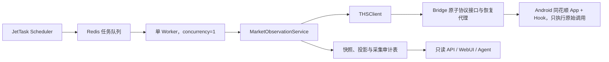
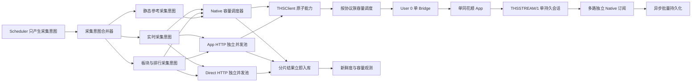

# 同花顺 App 生产采集容量与调度优化设计方案

## 1. 文档定位

本文定义同花顺 App 数据接入进入生产运行后的容量、调度、隔离、失败恢复和扩容方案。

本文不是只优化某一个耗时 501 秒的任务，也不以提高单个函数的并发数为目标。501 秒只是当前架构已经出现容量失衡的直接证据。本文覆盖：

- 同花顺原生协议、App HTTP 代理和可脱离 App 的 HTTP 接口如何分流；
- 支持持续推送的原生行情如何由单 App 的一个持久会话同时维护多路订阅；
- 实时、准实时、批量和参考数据如何确定不同的新鲜度目标；
- 单路 Android Native Bridge 如何进行优先级调度、任务合并和背压；
- 大任务如何拆分、断点续跑并按批次持久化；
- 实时任务如何避免被板块全量任务长时间阻塞；
- 单 App 实例容量不足时如何通过减少重复查询、分协议队列和独立虚拟机扩容；
- 只有同虚拟机 App 多开无法稳定运行时，才如何使用多 Android 虚拟机兜底；
- 如何根据任务排队时间和数据新鲜度判断系统是否真的跟得上。

本方案继续遵守以下既有边界：

- 真机负责逆向研究和同一时点页面核对；
- 服务器 Android 虚拟机负责无人值守生产采集；
- WebUI、Agent 和查询 API 只读取数据库，不直接触发同花顺上游请求；
- 同花顺页面口径的数据不得静默替换为其他数据源口径；
- 请求/响应型原生回调统一经过单 App 全局单飞边界；订阅型行情在同一个 App 中通过持久会话并行常驻；Direct HTTP 与 App HTTP 不占用 Native 单飞容量。

本方案增加一条不可退让的容量原则：**不得通过降低动态市场数据的调度频率来掩盖性能问题。** 如果当前通道容量无法满足现有或目标频率，应通过拆分通道、去除错误串行、减少重复上游查询、分片持久化和增加独立采集实例解决。

## 2. 当前架构与容量问题

### 2.1 改造前生产链路



改造前架构已经实现了任务幂等、来源锁、失败审计、App 恢复和数据库快照，但吞吐边界仍然非常明显：

1. Worker 当前只有一个执行并发，任何长任务都会阻塞其他采集任务；
2. 同花顺 Native Bridge 共用 App 内部回调路由，客户端通过同一把锁串行调用；
3. 部分 App HTTP 代理请求也复用了 Native Bridge 的统一锁；
4. 一个调度任务内部会连续执行大量原生调用，期间无法让更高优先级任务插队；
5. 调度器按固定周期持续投递，成功状态不能反映任务实际排队了多久；
6. 过期的实时任务仍可能排队执行，消耗通道后写入已经失去价值的历史快照。

### 2.2 App、Bridge、Client 与应用层的职责边界

Android App、Hook 和 Bridge 不得包装“板块核心快照”“市场总览”或“热点轮动”等业务聚合能力。它们只负责把同花顺运行时中的原始协议能力稳定暴露给服务端，包括：

- 原始调用路由和协议类型；
- 原始请求参数、分页参数、排序字段、选择器和指标 ID；
- 原始响应结构、状态码和上游错误；
- App 版本、协议版本、会话与设备运行状态；
- 单次调用耗时、重试、超时和回调清理结果；
- App 崩溃、会话失效和 Bridge 恢复能力。

Bridge 不负责：

- 决定一次业务快照需要调用哪些接口；
- 在 Android 进程内循环请求 26 组数据；
- 合并热门板块、排行、资金流和成分股；
- 解释同花顺字段的金融业务含义；
- 生成数据库快照、最新投影或页面 DTO；
- 控制业务调度频率、优先级和数据新鲜度。

服务端各层职责为：

| 层级 | 职责 |
|---|---|
| `THSClient` | 使用 Bridge 暴露的原子协议接口，完成参数模型、字段标准化、错误归一化，并保留原始调用元数据 |
| 采集调度层 | 根据新鲜度和容量决定调用哪些 Client 原子能力，执行优先级、合并、背压和分片 |
| 应用服务层 | 从独立采集结果组装“板块核心”“市场总览”等业务视图，不直接控制 App 内部协议 |
| 持久化层 | 分片结果幂等入库，维护历史快照和最新投影 |
| 查询层 | 从数据库组合 API、WebUI 和 Agent 所需结果，不请求 App |

因此，“由客户端组装”不等于重新在一个 Client 方法中同步执行全部 26 组请求。Client 应提供细粒度能力；调度层独立执行和持久化；应用层最后从数据库或已完成结果中组合业务数据。

### 2.3 改造前任务耗时基线

以下数据是本次改造前的生产基线，用于说明旧架构为什么必须拆除，不代表当前任务形态：

| 任务 | 当前调度间隔 | 平均耗时 | P95 / 最大耗时 | 判断 |
|---|---:|---:|---:|---|
| 同花顺市场异动 | 30 秒 | 约 26.5 秒 | 约 56 / 57 秒 | 已接近通道上限 |
| 同花顺市场上下文 | 60 秒 | 约 16.9 秒 | 约 44 / 48 秒 | 单独运行可接受 |
| 个股动态分组 | 180 秒 | 约 79.2 秒 | 约 138 / 160 秒 | 需要与实时任务隔离 |
| 个股排行榜 | 120 秒 | 约 37.6 秒 | 约 95 / 105 秒 | 高峰期存在积压风险 |
| 同花顺板块信号 | 300 秒 | 约 44.9 秒 | 约 100 / 136 秒 | 可改为分组更新 |
| 同花顺板块核心 | 300 秒 | 约 501.8 秒 | 约 736 / 762 秒 | 调度周期内无法完成 |

样本数量仍需继续积累，但板块核心任务平均耗时已经大于调度周期。即使其他任务全部停止，该任务也无法每 5 分钟完整运行一次。

非交易时段大量任务会跳过，Redis 来源锁也会避免部分重复执行，因此系统表面上可能持续显示成功或跳过；这不能证明交易时段的数据新鲜度符合要求。

## 3. 旧板块核心任务为什么需要约 501 秒

### 3.1 它是服务端组装出来的旧业务任务，不是 App 内部接口

改造前的 `collect_ths_sector_core_snapshot` 先执行板块核心采集，再执行板块成分参考补齐。板块核心采集本身包含：

| 请求类别 | 数量 | 组成 |
|---|---:|---|
| 热门板块 | 3 | 概念、行业、指数 |
| 板块排行 | 20 | 5 个分类 × 4 个指标 |
| 板块资金流 | 3 | 行业、概念、地域 |
| 合计 | 26 | 不包含随后执行的成分股参考补齐 |

其中板块排行的 5 个分类为：全部、行业、概念、风格、地域；4 个指标为：涨幅、涨速、量比、涨停数。

这 26 组调用是当前服务端 `MarketObservationService` 为形成“板块核心”业务快照而选择和组装的，不是同花顺 App 内部提供的一个“大而全”接口。App/Hook/Bridge 应继续保持原子协议边界，把每一种排行、分类、指标和分页能力完整暴露给 `THSClient`；服务端负责决定本轮需要调用其中哪些能力。

当前问题不是 App 包装过多，而是服务端又把这些原子能力聚合成了一个不可中断、统一完成后才交付的长任务。优化时不得把拆分后的调度复杂度下沉回 Android App。

### 3.2 26 组调用实际被串行执行

虽然代码先构造了多个 Awaitable，但随后使用普通 `for` 循环逐个 `await`。需要经过原生桥接的请求还会进入 `_native_sector_request_lock`，因此不会形成真正并发。

原生桥接的单次调用还包含：

- 最长 75 秒 HTTP 超时；
- 失败后最多两次尝试；
- 首次失败后的等待；
- 每次成功后的 0.9 秒静默期，用于释放和清理 App 内部回调路由；
- Bridge、Android 进程和同花顺上游服务本身的往返时间。

501.8 秒除以 26 组高层调用，平均约为 19.3 秒/组。由此可以判断主要耗时来自连续的 App 原生协议往返，而不是一次性数据库写入。

当前还缺少精确到每一个 Bridge 路由、分类和指标的耗时埋点，因此不能把 501 秒机械地平均归因给每个接口。后续必须记录每次子请求的排队时间、上游时间、静默等待、重试次数和响应大小，才能定位最慢的具体组合。

### 3.3 后续参考补齐会继续占用通道

核心采集完成后，同一个外层任务还会执行板块参考补齐：

1. 再次读取概念、行业和指数热门板块；
2. 从待补齐板块中选择最多 3 个；
3. 每个板块读取最多 1000 个原生成分股；
4. 分别写入参考快照。

参考补齐在采集审计中有独立任务名称，因此前述 501 秒主要是核心采集本身；但从 Worker 和 Native Bridge 的实际占用看，参考补齐仍然紧跟在同一个队列任务后继续消耗容量。

## 4. 设计目标

### 4.1 新鲜度目标

| 等级 | 数据类型 | 目标 |
|---|---|---|
| P0 实时 | 大盘异动、个股异动、竞价异动 | 交易时段不低于当前 30 秒频率，端到端新鲜度 P95 不超过 60 秒 |
| P1 准实时 | 市场上下文、资金、排行榜、动态分组 | 不低于现有调度频率，目标逐步提升到 30～60 秒级结果可见 |
| P2 板块动态 | 热门板块、板块排行、资金流、热点轮动 | 所有动态维度每轮完整更新，目标 60～120 秒内结果可见，不使用轮换降低单维度频率 |
| P3 静态参考 | 板块身份、成分映射和低频配置 | 仅真正低频或事件驱动的数据盘后维护；行情、资金和排行不得归入本级 |

不同数据不能因为都来自同花顺 App 就使用相同调度频率。

这里的分级用于分配执行通道、截止时间和故障优先级，不用于主动降低市场动态数据的采集频率。优先级只能决定同一瞬间谁先获得资源，不能允许低一级的动态数据长期过期。

### 4.2 可靠性目标

- 单个批量任务不得连续独占 Native Bridge 超过 30 秒；
- 每个成功子请求完成后立即幂等入库，不等待整组任务全部完成；
- App、Bridge 或 Worker 中途失败时，已经完成的分片不得丢失；
- 同一数据能力的过期排队任务应合并，只保留最新待执行意图；
- P0/P1 任务不得被 P3 批量任务长期阻塞；
- 查询 API 在采集异常时继续返回最后一份有效数据，并明确新鲜度。

## 5. 数据通道分级

每个同花顺 Client 能力必须登记传输类型，禁止所有请求无差别进入同一把锁。

| 通道 | 定义 | 并发原则 |
|---|---|---|
| `native_stream` | App 原生 TCP 行情 Client 支持持续订阅和增量回调 | 一个 App 进程内建立一个服务端持久会话，会话内维护多个独立订阅；不按指标轮询，不占用请求/响应锁 |
| `native_callback` | 必须通过 App 原生请求与异步回调获得结果 | 当前单 App 统一单飞；只有经过当前版本跨协议交叉压力验证后才可提高某一协议族容量 |
| `app_http` | 需要 App 会话、网络栈或签名，但本质是 HTTP | 经稳定性验证后使用独立有限并发池 |
| `direct_http` | 已能脱离 App 稳定重放的公开或签名已实现接口 | 不占用 Native 通道，可正常异步并发 |
| `database_only` | 从既有快照计算或投影的数据 | 不发起上游请求 |

`/proxy` 已从 Native 锁中移出，使用独立并发信号量；生产由专用 App HTTP 实例承接。它不再执行 Native 回调清理所需的静默等待，也不会阻塞 UnifiedRequest 或 Hurricane。

无论使用哪种通道，Bridge 对服务端都必须保持原子调用模型：一次 Bridge 请求对应一次明确的同花顺协议动作。批量循环、跨接口聚合、金融字段解释和业务结果组装均留在服务端。

Bridge 可以提供统一的技术信封，但不能隐藏协议细节：

```json
{
  "success": true,
  "route": "native/hurricane",
  "request": {},
  "raw_response": {},
  "runtime": {
    "app_version": "...",
    "duration_ms": 0,
    "retry_count": 0
  }
}
```

正式业务表不要求保存全部原始响应，但 Client、调试日志和采集审计必须能够追溯对应的原始参数、协议路由和响应版本。

### 5.1 当前同花顺能力通道审计

根据现有 `THSClient` 和生产 Bridge 代码，当前能力可以归为以下几类。

#### 5.1.1 已经直接走 HTTP，不占用 Native 锁

| 能力 | 当前实现 | 当前状态 |
|---|---|---|
| 北向成交历史 | 直接请求 `eq.10jqka.com.cn` | 正确，不应进入 App 锁 |
| 上证 50、创成长情绪历史 | 直接请求 `eq.10jqka.com.cn` | 正确 |
| 市场估值阈值 | 直接请求 `eq.10jqka.com.cn` | 正确 |
| ETF 盘中预估申购净流入 | 三个公开 HTTP 请求并发 | 正确 |
| 指数热门板块 | 直接请求 `dq.10jqka.com.cn` | 正确 |
| 动态分组配置 | 直接 HTTP 获取配置 | 正确；组内股票仍依赖 Native |
| 商品联动现货、产业列表 | 直接 HTTP | 正确；部分报价补齐仍依赖 Native |
| 同花顺公开热榜和板块目录 | 直接 HTTP | 正确 |

这些能力必须继续使用普通 `httpx` 连接池并发执行，不能因为同属 `THSClient` 就经过 Android Bridge。

#### 5.1.2 App HTTP 独立并发通道

| 能力 | 当前上游 | 当前实现 |
|---|---|---|
| 板块热点轮动 | `eq.10jqka.com.cn/.../hot_block_list` | 经专用 App HTTP Bridge `/proxy` 请求，独立有限并发 |
| 行业机会 | `fund.10jqka.com.cn/.../choose_industry` | 经相同 App HTTP 并发池请求，不占 Native 锁 |

生产恢复代理只会串行 `path.startswith("/native/")` 和 `/jsbridge`，明确不会串行 `/proxy`。App 内部 `/proxy` 也使用独立线程处理 HTTP 请求。因此当前串行来自服务端 Client 的错误复用，而不是 App 的必然限制。

独立 App HTTP 通道遵守以下约束：

- 直接调用恢复代理的 `/proxy`；
- 不获取 `_native_sector_request_lock`；
- 不执行 Native 回调所需的 0.9 秒静默等待；
- 使用独立连接池和有限并发信号量；
- 保留 App 会话失效、HTTP 状态和响应解析重试；
- 通过压力测试确定并发上限，当前默认值为 8。

如果后续确认某个 `/proxy` 接口能够在服务器上直接携带必要参数稳定调用，则进一步迁移到 `direct_http`，完全绕过 Android。

#### 5.1.3 已迁移到 Native 持久订阅通道

以下七类实时指标已经不再通过 `/native/realtime` 周期轮询，而是由 User 0 App 内的原生行情 Client 建立七个独立订阅，并复用一条 `THSSTREAM/1` 服务端长连接：

- 大盘资金；
- 市场温度；
- 北向资金；
- 富时 A50 期指；
- 道琼斯期指；
- 逆回购；
- 美元/人民币。

同一条长连接还维护五路 Unified 事件订阅：

- 大盘异动曲线；
- 大盘异动事件；
- 个股异动；
- 板块异动；
- 大单异动。

Hook 将每个 Native 回调封装为带 `subscription_id`、`sequence`、`response_type`、`key` 和 `emitted_at` 的事件。服务端异步消费事件，按小批次写入既有 `ft_market_snapshots`，不等待其他订阅返回。

持久订阅遵守以下规则：

- 同一 App 只建立一个服务端 Socket 会话，但一个会话可以维护多个原生订阅；
- 每个订阅拥有独立 Native Client 和回调对象，不来回切换指标；
- 服务端断线后自动重连，并完整恢复全部订阅；
- 七路行情订阅可以直接注册；五路 Unified 事件订阅必须按首个 Native 成功响应逐路初始化，因为 App 全局初始化 Frame 同时只能承载一路请求；
- 某个订阅首次没有返回时只重试该订阅，不重建已经正常工作的订阅；
- Native 回调只写入有界队列，独立 Writer 线程负责 Socket 输出，禁止网络背压阻塞 App 回调线程；
- 服务端分别维护行情和事件两类 Redis 健康租约；对应租约有效时，旧轮询任务跳过相同能力，租约失效后才允许旧路径作为降级兜底。

#### 5.1.4 仍需请求/响应型 Native 通道

| 能力 | Native 路由 | 当前用途 |
|---|---|---|
| 集合竞价 | `/native/unified` | 竞价快照和曲线 |
| 个股九类排行榜 | `/native/unified` | 涨跌、涨速、成交、资金等排行 |
| 概念和行业热门板块 | `/native/hurricane` | 热度排行 |
| 动态分组股票 | `/native/hurricane` | 首页动态分组 |
| 板块排行和资金流 | `/native/ranking-debug`、`/native/hurricane` | 板块多维排行 |
| 板块成分股 | `/native/hurricane` | 原生成分列表 |
| 景气度和部分商品联动 | `/native/ranking-debug`、`/jsbridge` | 原生派生指标和报价 |
| 长短期国债及基准 | `/native/unified` | 债市曲线 |

大盘、个股、板块和大单异动只在事件长连接失效时回退到请求/响应路径。其正常生产链路不占用周期查询容量。

#### 5.1.5 Native 容量按协议族隔离

同一生产 App 的并发能力已经通过绕过恢复代理、直接访问 Hook 的受控实验确认：

- Ranking 使用协议要求的 `frameId=2312`。单请求获取 500 行耗时约 0.07 至 0.17 秒；两个及以上并发会丢回调，因此容量固定为 1。
- Ranking 回调返回后，App 仍会异步注销固定 Frame 路由；Proxy 在容量锁内保留 0.9 秒清理窗口，避免后一个请求偶发等待满 60 秒。
- Hurricane 隔离实验曾支持八路并发，但与 Ranking、Unified 交叉运行时出现过 App 原生崩溃。当前生产安全边界是单 App Native 请求/响应共用一个单飞门限；吞吐提升主要依靠持久订阅、完整表格复用、HTTP 外移和减少重复查询。
- 随意为请求分配新 Frame ID 会导致 Ranking 全部超时，Hurricane 等待满回调窗口；Frame ID 不是可自由生成的请求 ID。
- 不同 Native 请求族不能仅凭不同外层连接推断可并行；只有经过当前 App 版本交叉压力验证后才能提高容量。
- Realtime 使用 `THSSTREAM/1` 持久订阅，不进入上述请求/响应容量池。

Client 在建立 HTTP 请求前申请对应协议容量，Proxy 再执行跨进程同样的容量约束。这样排队时间不会消耗 HTTP 回调超时，多 Worker 也不能绕过 App 的真实上限。

### 5.2 混合能力必须拆开执行

以下 Client 方法同时包含 HTTP 和 Native 步骤，不能继续作为一个不可拆分调用占用同一任务：

- 动态分组：HTTP 配置获取与 Native 组内股票查询分离；
- 热门板块：公开 ETF/板块补充与 Native 热度查询分离；
- 商品联动：公开现货/产业列表、Native 期货列表和 Native 报价补齐分离；
- 板块信号：HTTP 轮动、HTTP 行业机会、Native 景气和混合商品联动分离。

HTTP 部分应立即并发执行并独立入库；Native 部分进入 Native 调度器。任何一个 Native 子能力失败都不应阻止已经成功的 HTTP 结果落库。

## 6. 目标调度架构



核心原则是：调度器不再直接投递一个需要连续运行十分钟的业务大任务，而是投递可以合并、排序和独立持久化的采集意图。Android 层不接收“采集整个板块核心”这样的业务命令，只接收 Client 已经展开好的单次原始协议调用。

优先级只解决突发资源争用，不承担“少采一点”的职责。系统必须为所有到期动态能力提供足够总容量；如果总需求超过单 App 实例吞吐，应优先在同一 Android 虚拟机内增加隔离的 App Native Lane，只有该方式不能稳定运行时才增加 Android 虚拟机，而不是让较低优先级的行情长期排队。

## 7. 任务拆分与持久化

### 7.1 拆除板块核心“大包任务”

原来的板块核心任务拆为独立能力单元：

- 热门板块：概念、行业、指数各自独立；
- 板块排行：每个“分类 × 指标”独立；
- 板块资金流：行业、概念、地域各自独立；
- 板块成分：每个板块代码独立；
- 板块轮动和派生信号：每个来源接口独立。

这些能力单元由 `THSClient` 以独立方法和明确参数暴露。调度层选择和执行能力单元，Android Bridge 不维护板块类别列表、指标枚举、业务批次或组合顺序。

### 7.2 用完整原始快照减少重复 Native 查询

生产验证已经确认：单次原生表格请求可以返回一个分类的完整板块集合，并同时携带涨幅、涨速、量比和领涨股字段。行业返回 90 行、概念返回 386 行、风格返回 104 行、地域返回 33 行；“全部”分类通过 `startrow` 分页读取。

正式流程为：

```text
每个板块分类请求一次完整原始表格
  → Client 标准化所有指标列
  → 分片立即入库
  → 服务端分别按涨幅、涨速、量比排序
  → 一次持久化三种最新排行投影
```

这种方案不在 App 内包装业务，App 只返回原始表格，排序和投影由 Client 完成。涨停数不在表格字段中，继续使用独立 Hurricane 查询；行业、概念、地域资金流继续使用对应资金表，避免改变同花顺口径。板块核心调度因此从 26 个任务降为 16 个，同时全部保持 60 秒刷新。

### 7.3 原子任务身份与重复意图合并

每个能力单元具有稳定的 `dedupe_key`，例如：

```text
ths:sector_ranking:concept:change
ths:sector_flow:industry
ths:sector_constituents:885756
```

### 7.4 分片完成即入库

当前核心采集先把全部响应收集到内存，最后统一形成 `ObservationBatch` 并持久化。目标架构改为：

```text
领取一个分片
  → 调用一个上游能力
  → 标准化
  → 幂等写入快照和最新投影
  → 更新分片状态
  → 释放 Native 通道
```

单个分片失败只影响该分片，不回滚已经完成的其他数据。

### 7.5 静态参考数据断点续跑

板块成分股按板块代码建立每日检查点：

- 已完成的板块当天不重复读取；
- 失败板块进入延迟重试，不阻塞其他板块；
- 盘中仅补齐新出现且确实被使用的热门板块；
- 全市场补齐和周期校验在盘后执行；
- App 版本或板块身份映射变化时可以定向失效，而不是全量重跑。

## 8. 优先级、合并与背压

### 8.1 Native 通道优先级

```text
P0 实时事件 > P1 市场状态 > P2 板块观察 > P3 批量参考
```

调度器在每个 Native 分片结束后重新选择最高优先级任务，使实时任务可以在批量分片之间插队，而不是等待整个板块核心任务结束。

为避免 P3 永久饥饿，低优先级任务随等待时间获得有限的优先级提升，但交易时段不得突破 P0 的新鲜度目标。

### 8.2 过期任务合并

快照型任务只关心最新状态。同一 `dedupe_key` 在等待期间再次被调度时：

- 不追加新的队列记录；
- 更新该意图的最新请求时间和截止时间；
- 当前执行结束后，如果结果已经覆盖最新时间窗口，则不再重复执行；
- 事件流任务不得按快照规则丢弃，必须依据上游游标或事件 ID 续采。

### 8.3 背压策略

当 Native 队列预计等待时间超过阈值时：

1. 合并同一时间窗内语义相同、尚未执行的重复快照意图；
2. 静态参考任务让出资源；
3. 动态市场任务继续按照原定频率产生最新采集意图；
4. 立即触发容量告警和扩容判定；
5. 禁止通过修改调度周期让告警暂时消失。

合并只消除重复执行。例如一个 30 秒快照仍在排队时，新一轮同类快照到达，可以把旧意图替换为最新意图；它不能把稳定运行频率从 30 秒降低到数分钟。

## 9. Worker 与 App 实例隔离

### 9.1 Worker 分工

至少拆分为：

| Worker | 职责 |
|---|---|
| `ths_dispatcher` | 采集意图合并、优先级和 Native 单路调度 |
| `ths_http_worker` | 已验证安全的 App HTTP 请求 |
| `market_http_worker` | 东方财富、交易所和其他普通 HTTP 数据源 |
| `market_persist_worker` | 数据标准化后的批量写入和投影，可与采集解耦 |

增加普通 Worker 并发可以提高 HTTP、计算和写入吞吐；Native 请求只能在各协议族已经验证的容量内并发。

### 9.2 单 App、单 Bridge 与分协议并发

生产最终只保留 Owner / User 0 中的一个同花顺 App。额外 Android 用户和 Ranking/Sector Bridge 已删除，所有 Native Lane 统一指向：

```json
{
  "default": "http://127.0.0.1:49301",
  "events": "http://127.0.0.1:49301",
  "hurricane": "http://127.0.0.1:49301",
  "realtime": "http://127.0.0.1:49301",
  "ranking": "http://127.0.0.1:49301",
  "sector_table": "http://127.0.0.1:49301"
}
```

App HTTP Bridge 同样通过 `49301` 进入，但 `/proxy` 不获取 Native 容量。恢复代理只对 Native 请求/响应调用实施单 App 单飞；Direct HTTP 和 App HTTP 继续独立并发。这样既避免 App 内 Frame 与回调错配，也不会把普通 HTTP 人为串行。

这里的 `realtime` 已分为两种语义：旧 `/native/realtime` 是单次请求/响应能力，`THSSTREAM/1` 是持久订阅协议。前者保留为健康租约失效时的兼容兜底；正常生产流量只使用后者。持久订阅不获取恢复代理的单次请求锁。

### 9.3 独立 Android 虚拟机仅作为兜底

满足以下任一条件时，相关能力才迁移到独立 Android 虚拟机：

- 后台用户无法维持 `CommunicationService` 或行情 TCP 会话；
- 协议必须依赖持续前台页面注册，工作资料无法稳定保持该状态；
- 同一 Android 内多个用户仍共享不可隔离的系统级行情资源；
- 多用户被系统回收，且前台服务、WakeLock 和白名单仍无法解决；
- 同一设备指纹下多 App 会话被同花顺上游限制。

因此，多 Android 虚拟机不是默认扩容方式，而是单 App 在完成去重查询和协议分流后仍容量不足时的兜底。

## 10. 失败恢复与数据语义

- 调度成功、开始执行、上游成功、数据入库和投影完成必须是不同状态；
- 上游成功但入库失败时，只重试持久化，不重复调用同花顺；
- App 重启后，执行中的原生分片回到待重试状态；
- Native 超时必须记录发生在哪个能力、分类和指标；
- Hook `/health` 必须返回 `realtime_stream_sessions`。只要持久会话仍然存在，任何 `/native/unified`、`/native/hurricane` 等旧单次请求超时都只能让该次请求失败，禁止 `force-stop` 整个 App；
- 只有 Hook 不健康或持久会话数为零时，恢复代理才可以重启 App；重启后流服务负责重连并恢复全部订阅；
- 部分成功不能覆盖为整体成功，也不能删除最后有效快照；
- 查询结果必须返回 `source_time`、`collected_at`、`freshness_status` 和最后成功时间；
- 实时任务超过截止时间后，应标记为过期而不是伪装为最新数据。

## 11. 可观测性

现有采集运行记录需要补充子请求级指标：

| 指标 | 含义 |
|---|---|
| `schedule_delay_ms` | 理论调度时间到任务真正开始的延迟 |
| `queue_age_ms` | 采集意图在队列中的等待时间 |
| `native_wait_ms` | 等待 Native 锁或优先级通道的时间 |
| `upstream_duration_ms` | 同花顺上游实际处理时间 |
| `bridge_cleanup_ms` | 回调清理和静默等待时间 |
| `persist_duration_ms` | 数据库入库与投影耗时 |
| `request_count` | 一个业务任务实际展开的上游调用数 |
| `retry_count` | Bridge 和上游重试次数 |
| `coalesced_count` | 被合并的重复快照任务数 |
| `freshness_lag_ms` | 当前时间与最新有效来源时间的差值 |
| `native_lane_utilization` | Native 通道在统计窗口中的占用率 |

必须建立按能力和传输通道聚合的 P50/P95/P99 面板。只看任务成功率无法发现持续排队和数据过期。

容量判断使用：

```text
通道利用率 = 统计窗口内 Native 实际占用时长 / 统计窗口总时长
```

- 长期高于 70%：进入容量预警；
- 长期高于 85%：禁止继续向同一实例分配新增能力，立即启动扩容；既有动态任务保持原频率；
- 达到或超过 100%：系统必然积压，调度频率没有实际意义。

## 12. 保持高实时性的刷新策略

| 能力 | 当前频率 | 目标频率与容量要求 |
|---|---|---|
| 大盘、个股和竞价异动 | 30 秒 | 保持或提升；P95 新鲜度不超过 60 秒 |
| 市场上下文和资金 | 60 秒 | 保持或提升；HTTP 与 Native 并行 |
| 个股排行榜 | 120 秒 | 不降低；拆分九种模式并分配独立 Native 容量 |
| 动态分组 | 180 秒 | 不降低；配置 HTTP 与组内 Native 分离 |
| 热门板块 | 当前包含在 5 分钟核心任务 | 提升到 60 秒级结果可见 |
| 板块排行 | 当前包含在 5 分钟核心任务 | 全部分类与指标 120 秒内完整更新，不轮换遗漏 |
| 板块资金流 | 当前包含在 5 分钟核心任务 | 60～120 秒内完整更新 |
| 板块轮动和派生信号 | 300 秒 | 不降低；HTTP 部分可提高频率，Native 部分独立执行 |
| 原生成分映射 | 每轮最多补 3 个板块 | 身份变化事件驱动；成分行情由独立行情快照保证实时 |

原生成分映射属于低频身份数据，不需要反复读取相同名单；但成分股价格、涨幅、资金等动态字段必须由实时行情能力更新，不能借“参考数据低频”降低行情实时性。

## 13. 验收标准

### 13.1 功能验收

- 所有既有同花顺数据能力均有明确的通道类型和新鲜度等级；
- 板块核心不再作为一个不可中断的 26 请求大任务运行；
- App HTTP 和 Direct HTTP 请求均不获取 Native 锁；
- `/proxy` 请求不再执行 Native 的 0.9 秒静默等待；
- 所有动态能力保持或提升当前调度频率；
- 每个分片成功后可以立即从数据库查询到；
- 成分股补齐支持断点续跑；
- 查询链路不直接调用同花顺 App；
- App 重启和 Worker 重启不会制造重复快照或丢失已完成分片。

### 13.2 性能验收

必须在完整 A 股交易日进行至少连续 5 个交易日的生产回放或实盘观测：

- P0 数据端到端新鲜度 P95 不超过 60 秒；
- P1 数据端到端新鲜度 P95 不超过 90 秒；
- 板块动态数据完整更新周期不超过 120 秒；
- Native 队列 P0 等待时间 P95 不超过 15 秒；
- 不存在持续增长的队列积压；
- 单个 P2/P3 分片占用 Native 通道不超过 30 秒；
- 过期快照任务能够被合并，不发生补跑无价值旧状态；
- 一次 App 崩溃或 Bridge 重启后能够自动恢复且已写入数据不丢失。

### 13.3 扩容判定

完成单实例任务拆分、HTTP 分流和优先级调度后，如果仍满足以下任一条件，则先增加同一 AVD 内的 App 生产实例：

- 交易时段 Native 通道利用率连续多日超过 85%；
- P0/P1 新鲜度连续不能达标；
- P3 每日批量任务无法在下一个交易日前完成；
- 单实例容量模型显示下一调度窗口无法在截止时间前完成全部到期动态任务。

完成单 App 查询去重和分协议调度后仍无法达标，且命中 9.3 节任一条件时，才增加独立 Android 虚拟机。

## 14. 当前实施结果

本方案的第一阶段生产改造已经完成，当前代码和生产环境不再运行旧的板块核心、板块信号大包任务。

### 14.1 单 App 实例和能力路由

- 生产只保留 Owner / User 0 的同花顺 App、一个 Hook 和一个恢复代理；
- 全部 Native Lane 统一路由到 `49301`；
- Ranking、Hurricane、Unified 请求/响应统一遵守单 App 单飞边界；App HTTP 和 Direct HTTP 不占 Native 容量；
- 两个历史 Android 用户、两个冗余 Bridge 和临时基准进程已经清理。

### 14.2 原子任务和立即持久化

旧板块核心任务已经收敛为 16 个独立调度单元：

- 3 个热门板块分片，每 60 秒；
- 5 个板块完整表分片，每次派生涨幅、涨速、量比三个榜单，每 60 秒；
- 5 个独立涨停数分片，每 60 秒；
- 3 个板块资金流分片，每 60 秒；
- 板块成分参考补齐使用独立任务，不再跟在核心任务后连续占用通道。

旧板块信号任务已经拆为 13 个独立调度单元：

- 10 个“行业/概念 × 轮动指标”分片；
- 行业机会、板块景气、商品联动各一个分片；
- 每个分片成功后独立写快照和最新投影，其他分片失败不会回滚已完成结果。

生产 Scheduler 当前注册 70 个采集计划，旧的 `collect_ths_sector_core_snapshot` 和整包板块信号计划已经移除。

### 14.3 正式调度并发

Worker 并发负责同时推进 Direct HTTP、App HTTP 和 Native 任务队列；Native 请求/响应在 App 内统一串行执行。板块涨幅、涨速和量比不再进入 Legacy Ranking 队列，而是采用与原生板块页面相同的 `QueryClient` 数据路径：

1. Hurricane 查询一次板块全集；
2. 将板块代码作为显式 `Security` 列表交给 MobileHQ `QueryClient`；
3. 一次返回名称、指数、涨幅、涨速和量比；
4. Client 在内存中排序并派生多个榜单。

Client 依次取得各类板块全集，再通过显式 `Security` 的 MobileHQ `QueryClient` 补齐行情，最终结果在五个分类榜单之间共享。Ranking、Hurricane 和显式 `Security` 查询最终共享 App 进程内的原生传输、固定 Frame 与回调注册表，因此统一经过一个 Native 单飞边界；不同 HTTP/TCP 连接不能隔离这些 App 全局状态。吞吐提升来自完整表格复用、批量查询和 HTTP 能力外移，而不是在同一 App 内重叠原生请求。

### 14.4 已完成验证

- Legacy Ranking 连续调用存在回调丢失：不同调用方式下 20 次请求仅成功 7 至 11 次，因此它不得继续作为板块核心行情的主路径；
- Hurricane 回调完成条件已改为“字段齐全立即完成；收盘后涨速等可选字段无值时，在全部证券和必需字段到齐后仅等待一个有界收尾窗口”，不再因上游没有产生可选指标而空等 40 秒；
- 通过 Hurricane 板块全集加显式 `Security` QueryClient，行业 90、概念 390、风格 105、地域 33，共 618 个板块的核心行情实测墙钟为 13.393 秒；
- 完整板块采集共 16 个能力单元，包括五类行情榜单、五类涨停数、三类资金流和三类热门板块；生产隔离验收 16/16 成功，总墙钟为 14.787 秒，旧链路约 501.8 秒；
- 名称、指数、涨幅和量比覆盖率为 100%；测试发生在收盘后，涨速为空属于市场时点语义，不允许伪造或沿用旧值；
- 领涨股和资金流不由该 QueryClient 行情请求推测，继续使用各自的原始数据源和独立任务；
- 隔离实验曾观察到纯 Hurricane 多路请求成功，但跨 Ranking、Unified 的交叉压力会触发回调错配或 App 崩溃，因此该结果不作为生产容量；生产统一采用单 App Native 单飞边界；
- 代理上游等待时间已提高到 75 秒，覆盖 Hook 的最大回调预算，避免 32 秒误判超时；
- App HTTP 和 Direct HTTP 已验证不等待 Native 查询锁；
- 调度、板块管道、市场 Client 和 Bridge 路由回归测试通过。
- 五路 Unified 异动已迁移为持久事件订阅；生产请求/响应降级路径从约 33.5 秒降到约 3.0 秒。
- 当前活跃概念、行业、指数板块的成分查询分别实测 204 行/1.636 秒、527 行/3.903 秒、184 行/1.356 秒；候选只取最新交易日，陈旧代码不再长期占据补齐队列。
- 商品联动现货和产业列表通过直接 HTTP 并发读取，期货保留 Native 原子请求，关联行情批量补全；生产全量 315 条实测 3.440 秒。

尚需在完整 A 股交易时段持续采集第 11 节指标，并按 13.2 节完成连续五个交易日的新鲜度验收。该项属于生产容量观测，不影响当前单 App 架构投入运行。

### 14.5 单 App 多路实时订阅

实时行情链路已经完成从周期轮询到单 App 多订阅长连接的生产改造：

- User 0 App 内同时维护七路行情订阅和五路 Unified 事件订阅；
- 服务端通过一个 `THSSTREAM/1` Socket 消费所有订阅事件；
- 十二路数据均已进入正式消费链路，记录包含 `response_type` 和 `stream_sequence`；
- Unified 事件订阅按“前一路首个 Native 成功响应到达后再初始化下一路”的响应驱动方式启动，不使用固定等待时间，也不让五路初始化争用 App 全局 Frame；
- Redis 健康租约持续续期，旧轮询路径在长连接正常时自动停止；
- Hook 健康接口可以观测当前持久会话数量；
- 旧 Unified 请求连续多次超时期间，恢复代理均只返回该次失败并跳过 App 重启；生产 App PID 和持久会话保持不变；
- 服务具备断线重连、全量恢复订阅、单订阅首帧重试、有界输出队列和小批量幂等入库能力。

该实现证明一个 App 可以维护多路相互独立的原生行情订阅。后续新增同类指标时，应优先复用当前持久会话增加订阅，不应为每个指标增加 App 实例或恢复到 HTTP 轮询。

## 15. 最终结论

旧任务耗时约 501 秒并不是服务器性能不足。根本原因由两部分组成：服务端曾把大量原子协议调用包装成不可中断的大任务；同时错误地把 Legacy Ranking 当成稳定主通道，而该通道连续请求会丢回调。原生 App 的板块页使用页面生命周期内复用的 `QueryClient`，不会为每次刷新重新创建整套 Ranking 页面构造器。

正确方向是：

1. App/Hook/Bridge 只暴露原始协议能力和运行时细节，不包装业务集合；
2. `THSClient` 提供参数明确的原子能力，由服务端调度层决定如何调用；
3. App HTTP 与 Direct HTTP 完全移出 Native 锁和 Native 静默等待；
4. 用完整原始数据和 Client 本地组装减少重复 Native 查询；
5. 把业务大任务拆成独立、可持久化的最小采集分片；
6. 由应用层从已完成分片或数据库投影组装板块核心等业务结果；
7. 对重复快照意图进行合并和背压，但不降低动态数据调度频率；
8. 使用单 App 的持久订阅和可复用 QueryClient 数据路径保障实时任务，独立 Android 虚拟机只作为容量兜底；
9. 使用完整交易日的新鲜度和通道利用率持续校验容量。
10. 对支持推送的原生行情使用单 App、多订阅、单持久会话；请求/响应型旧任务不得因局部超时重启仍在承载订阅的 App。

这样优化后，同花顺 App 仍然可以作为重要生产数据源，但不会再由一个长时间串行任务决定整个市场数据系统的新鲜度。
