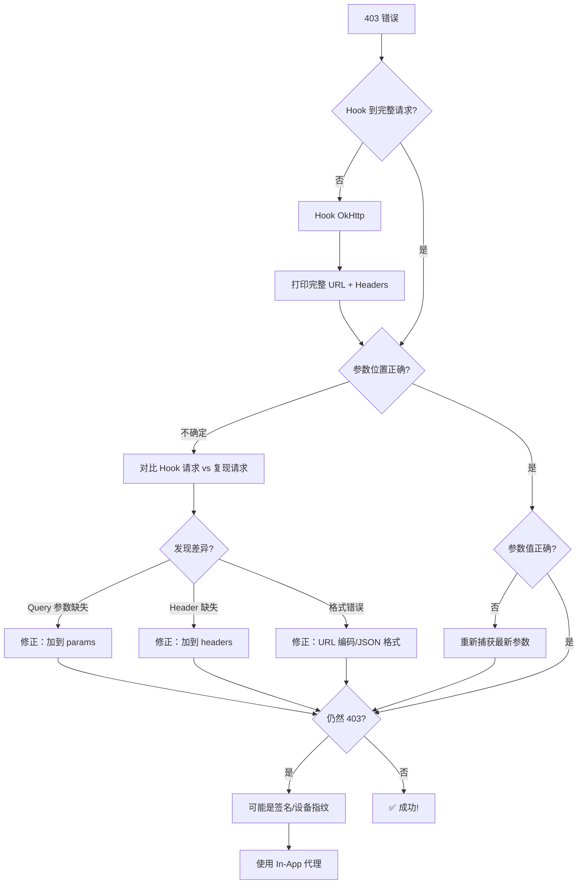

# 同花顺基金 API 逆向经验总结

**日期**: 2026-03-08
**App**: 同花顺 10.68.03
**逆向目标**: 基金持仓查询 API
**结果**: ✅ 成功 - 实现纯 HTTP 调用

---

## 核心成果

成功破解同花顺基金交易 API 的认证机制，实现了**完全脱离 WebView 的纯 HTTP 调用**。

**关键突破**：发现认证参数 `key1-key5` 必须放在 **URL Query 参数**中（而非 HTTP Headers），从而绕过 403 错误。

## 技术栈使用

### 主要工具

| 工具 | 作用 | 使用阶段 |
|------|------|---------|
| **Zygisk 模块** | Hook JSBridge，提供 HTTP 代理 API | 持续运行 |
| **Frida** | Hook OkHttp，捕获完整 HTTP 请求格式 | **关键调试阶段** |
| **ADB 自动化** | 触发 API 请求 | 测试验证 |
| **GLM-OCR** | 识别页面元素，自动化点击 | 自动化导航 |

### 工具分工

- **Zygisk**: 提供基础设施（JSBridge Hook、HTTP 代理）
- **Frida**: **发现关键突破点**（认证参数在 Query 中）
- **Python**: 最终的实用工具（纯 HTTP 调用）

## 遇到的问题

### 问题 1: HTTP 403 "非法访问"

**现象**：
- 从 Zygisk Hook 提取了 Cookie、token 等认证信息
- 使用 requests/curl 直接调用 API → 403 错误
- 即使添加完整 Headers 仍然失败

**错误假设**：
- ❌ 以为是签名/加密问题
- ❌ 以为需要设备指纹
- ❌ 以为 Cookie 过期

**实际原因**：
认证参数的**位置错误** —— 我把 `key5` 放在 Header 中，实际上应该在 URL Query 参数中！

### 问题 2: JSBridge Hook 信息不完整

**现象**：
```java
// JSBridge Hook 只能看到：
{"handlerName": "clientRequestHX", "data": {
    "url": "/rs/fundpositionquery/fundpositionassemble/100113970166",
    "params": {},  // ← 空！
    "Header": {}
}}
```

**问题**：
- 看不到实际发送的 Query 参数
- 看不到完整的 HTTP Headers
- 无法复现完整请求

**解决方案**：
Hook 更深层的 **OkHttp** 层面，捕获完整 HTTP 请求。

## 关键发现

### 发现 1: 认证参数在 URL Query 中

**错误做法**（导致 403）：
```python
headers = {
    "Cookie": "sess_tk=xxx; userid=xxx",
    "token": "eyJjSWQi...",
    "key5": "eyJjSWQi..."  # ❌ 错误：放在 Header 中
}
response = requests.get(url, headers=headers)  # → 403
```

**正确做法**（成功）：
```python
params = {
    "key1": "7246091a5f126b63",
    "key2": "2293a78f6581c12bbb334759458d4de3",
    "key5": "eyJjSWQi...",  # ✅ 正确：在 Query 参数中
    "key3": "100113970166",
    "key4": "auth"
}
headers = {
    "Cookie": "sess_tk=xxx; userid=xxx",
    "token": "eyJjSWQi...",  # Header 中也有 token
    "custId": "100113970166",
    "source": "SDK"
}
response = requests.get(url, params=params, headers=headers)  # → 200 成功！
```

### 发现 2: Frida Hook OkHttp 是关键

**Zygisk Hook JSBridge**：
```
URL: /rs/fundpositionquery/fundpositionassemble/100113970166
params: {}  // ← 看不到 Query 参数！
```

**Frida Hook OkHttp**（完整请求）：
```
URL: https://trade.5ifund.com/rs/fundpositionquery/fundpositionassemble/100113970166?key1=xxx&key2=xxx&key5=xxx&key3=xxx&key4=auth  ← 完整！
Method: GET
Headers:
  cookie: sess_tk=xxx; userid=xxx
  User-Agent: Hexin_Gphone/11.48.03 ...
  custId: 100113970166
  token: eyJjSWQi...
  source: SDK
```

**工具对比**：

| Hook 层次 | 能看到什么 | 看不到什么 |
|----------|-----------|-----------|
| JSBridge | API 端点、部分参数 | **Query 参数、完整 Headers** |
| OkHttp | **完整 URL、所有 Headers、Body** | - |

### 发现 3: Token 长期有效

**观察**：
- Token 有效期：28 天
- `key1`, `key2`, `key5` 在同一 session 中**固定不变**
- 一次捕获，28 天内可重复使用

**优势**：
- 无需频繁更新认证参数
- 可部署到云服务器，脱离手机运行
- 实现真正的"纯 HTTP 调用"

## 通用经验提炼

### 1. 认证参数位置不要假设

**教训**：不要只看 HTTP Headers，认证参数可能在：
- ✅ URL Query 参数（如 `?key1=xxx&key5=xxx`）
- ✅ HTTP Headers（如 `Authorization: Bearer xxx`）
- ✅ Request Body（如 `{"auth_token": "xxx"}`）
- ✅ Cookie（如 `sess_tk=xxx`）

**验证方法**：Hook OkHttp，打印**完整 URL**（不是 path，是完整 URL！）

### 2. Hook 层次选择

**原则**：由浅到深，逐层验证

| 层次 | Hook 点 | 优点 | 缺点 |
|------|---------|------|------|
| **应用层** | JSBridge, WebView.loadUrl | 业务逻辑清晰 | 信息不完整 |
| **网络层** | OkHttp, HttpURLConnection | **完整请求格式** | 日志可能多 |
| **系统层** | Socket, SSL | 最底层，绕不过 | 复杂，需解密 |

**建议**：
- 先 Hook JSBridge 了解 API 端点
- **关键：Hook OkHttp 捕获完整请求**
- 如果 OkHttp Hook 失败，再考虑更底层

### 3. Frida 是调试神器

**场景**：
- ✅ 快速验证假设（无需重新编译 Zygisk 模块）
- ✅ 临时添加 Hook 点
- ✅ 实时查看日志
- ✅ 动态修改参数测试

**组合使用**：
1. **Zygisk**：持久化 Hook（JSBridge、Cipher 等）
2. **Frida**：临时调试（OkHttp、验证假设）
3. **Python**：最终实现（纯 HTTP 调用）

### 4. 403 错误的系统性排查

**不要立即假设是签名问题！** 按步骤排查：



### 5. ADB 自动化的价值

**用途**：
- 自动触发 API 请求（无需手动点击）
- 快速验证 Hook 效果
- 批量测试不同场景

**示例**：
```python
from scripts.adb_automation import ADBAutomation

adb = ADBAutomation(device_id="<DEVICE_ID>")

# 自动导航到持仓页面
adb.screenshot_and_ocr()
adb.click_text("交易")
time.sleep(1)

adb.screenshot_and_ocr()
adb.click_text("持仓")

# 等待 API 请求完成
time.sleep(2)

# 从 logcat 提取数据
# adb logcat -d | grep "API"
```

## 新增知识文档

基于本次经验，新增了以下通用文档：

1. **[HTTP 403 认证失败排查](../troubleshooting/http_403_auth_failure.md)**
   - 认证参数位置判断
   - Hook OkHttp 捕获完整请求
   - 系统性排查流程

2. **[完整 HTTP 请求格式捕获](../strategies/complete_request_capture.md)**
   - Zygisk Hook OkHttp 实现
   - Frida Hook OkHttp 实现
   - 日志分析技巧
   - 对比工具

## 对 SKILL.md 的建议更新

### 更新 1: 阶段四（渐进式测试）后增加调试步骤

在 **"阶段四：渐进式测试"** 之后，建议增加：

**阶段 4.5：完整请求捕获（关键）**

如果需要外部 HTTP 调用，必须捕获**完整**请求格式：

```bash
# 方式 1: 在 MainHook.java 中添加 OkHttp Hook（推荐）
# 参考 knowledge/strategies/complete_request_capture.md

# 方式 2: 使用 Frida 临时调试（快速）
frida -H localhost:27042 -n "目标App" -l hook_okhttp.js

# 触发 API 请求，查看完整日志
adb logcat -d | grep -A 10 "\[HTTP Request\]"
```

**关键检查**：
- ✅ URL 包含 Query 参数吗？（`?key=value`）
- ✅ Headers 完整吗？（Cookie, Authorization, 自定义头）
- ✅ Body 格式正确吗？（JSON/FormData）

### 更新 2: 常见问题增加 HTTP 403 排查

在 **"常见问题与解决方案"** 部分增加：

**问题 X: 外部 HTTP 请求返回 403**

**问题**：
- 从 Hook 日志提取了 URL、Headers、Body
- 使用 requests/curl 复现 → 403 "非法访问"/"Illegal authorization"

**排查步骤**：
1. **确认捕获完整**：Hook OkHttp 打印完整 URL（包含 Query 参数）
2. **对比差异**：使用 diff 对比 Hook 请求 vs 复现请求
3. **检查参数位置**：认证参数可能在 Query、Headers、Body 的任意位置
4. **验证参数值**：URL 编码、Base64 格式、时间戳是否正确

**详细指南**：参考 [HTTP 403 认证失败排查](knowledge/troubleshooting/http_403_auth_failure.md)

### 更新 3: 工具说明增加 Frida

在 **"技术栈"** 部分明确 Frida 的定位：

| 工具 | 作用 | 使用场景 |
|------|------|---------|
| **Zygisk 模块** | 持久化 Hook，长期监控 | 基础设施 |
| **Frida** | 灵活的动态调试工具 | **临时验证假设、快速调试** |
| **ADB 自动化** | 触发 API 请求 | 测试验证 |

**Frida 使用示例**：
```bash
# 1. 启动 frida-server（手机）
adb shell "su -c '/data/local/tmp/frida-server -l 0.0.0.0:27042 &'"

# 2. 端口转发（WSL2 环境）
adb forward tcp:27042 tcp:27042

# 3. 运行 Hook 脚本
frida -H localhost:27042 -n "目标App" -l hook_okhttp.js

# 4. 在 App 中触发请求，查看日志
```

**适用场景**：
- 快速验证某个 Hook 点是否有效
- 临时添加日志查看某个变量
- 不想重新编译 Zygisk 模块时

## 项目文件

### 代码位置

```
/home/yuyang/frida-test/
├── ths/                                      # 同花顺 Zygisk 模块
│   └── app/src/main/java/com/yuyang/thshook/
│       └── MainHook.java                      # Zygisk Hook 代码
├── .claude/skills/reverse-app-skill/
│   ├── ths_fund_api.py                        # Python API 客户端
│   ├── scripts/
│   │   └── goto_fund_holdings.py              # 自动化导航脚本
│   └── examples/
│       └── monitor_holdings.py                # 持仓监控示例
└── docs/
    └── THS_Fund_API_Analysis.md               # 详细分析报告
```

### 临时文件

```
/tmp/
├── hook_http_headers.js                       # Frida Hook 脚本
├── frida_http_log.txt                         # Frida 捕获的日志
├── ths_cookie.txt                             # 提取的 Cookie
└── ths_api_config.json                        # API 配置文件
```

## 成果验证

### 功能测试

```python
from ths_fund_api import THSFundAPI

api = THSFundAPI()
holdings = api.get_holdings()

# ✅ 成功获取持仓数据
print(f"总资产: {holdings['singleData']['fundGeneral']['sumValue']:.2f} 元")
print(f"累计收益: {holdings['singleData']['fundGeneral']['sumAccumulatedIncome']:.2f} 元")
```

**输出**：
```
总资产: 4348.70 元
累计收益: -33.20 元
```

### 独立性测试

**测试 1**：在云服务器上运行（无需手机）
```bash
# 在远程服务器上
python3 monitor_holdings.py

# ✅ 成功运行，无需手机连接
```

**测试 2**：28 天内重复使用
```bash
# 7 天后测试
python3 ths_fund_api.py

# ✅ Token 仍然有效，无需重新捕获
```

## 总结

### 技术亮点

1. **完整的工具链**：Zygisk（基础）+ Frida（调试）+ Python（实用）
2. **关键突破**：认证参数位置的发现（Query vs Headers）
3. **长期可用**：Token 28 天有效，真正的"纯 HTTP 调用"

### 通用方法论

1. **不要假设**：认证参数可能在任何位置（Query/Headers/Body）
2. **由浅到深**：JSBridge → OkHttp → Socket
3. **工具组合**：Zygisk 持久化 + Frida 灵活调试
4. **系统排查**：403 错误不一定是签名问题

### 适用范围

本次经验适用于：
- ✅ 基于 WebView + JSBridge 的 App
- ✅ 使用 OkHttp 的 App
- ✅ 认证机制基于 Cookie/Token 的 API
- ✅ 需要外部 HTTP 调用的场景

---

**验证状态**: ✅ 已在同花顺 App 中验证成功
**适用性**: 通用方法，可应用于其他 App 逆向
